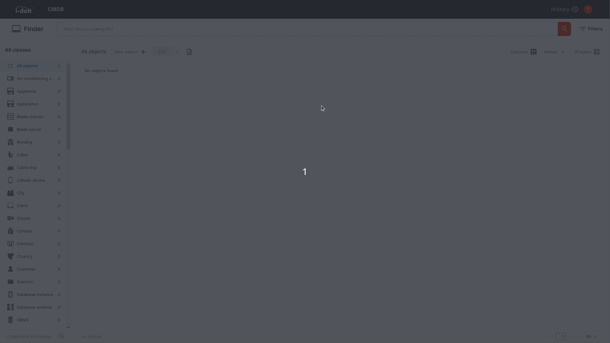

# Custom Categories

Besides having standard Categories docupike makes it possible to create custom Categories in order to document additional Attributes, which are not included in standard Categories.

## Rights

To create new custom Categories you need to have the `Rights > CMDB > Manage Categories` right.
To assign custom Categories to Classes you need the `Rights > CMDB > Manage Classes` right.

## How to create a custom Category

Custom categories are created at `Settings > Categories` there you need to Click on the `New Category` Button. You need to fill out a `Name` for the Category and you need to select a `Category Type` either `Single value` or `Multi value`.
Each custom category will have a unique `Constant` to identify the Category.
Custom Categories must be [assigned to a Class](link to classes) to be displayed there.

## Single or Multi value Categories

If you wish to use attributes which are unique in their combination, the configuration as `Single value` category will be sufficient.
If you want to use the values multiple times, you will need a `Multi value` category. This way it is possible to save multiple entries in one category.

## Custom Attributes

To customize your category you can add any number of attributes with the `New attribute` button. You will need the type in a `Name` for the attribute field and select a `Type` for the field.

Available field types are:

| Field Type  | Description |
| --- | --- |
| Text | The `Text` field is for entering plain text |
| Number | In the `Number` field you can insert decimal numbers |
| Boolean | The `Boolean` field is for selecting yes or no |
| Password | In the `Password` field is a masked field |
| Color | With the `Color` field you are able to insert a hex color code or select a color via the color picker by clicking on the palette within the edit mode |

## Create a custom Category and a attribute Field

