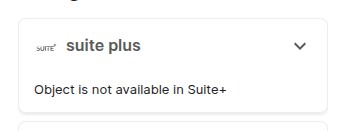
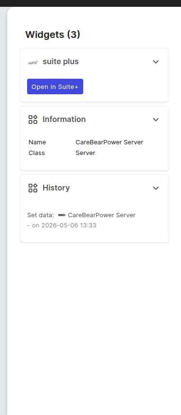

# Suite+ Bridge

Die **Suite+ Bridge** hält Objekte in i-doit up und Assets in **Suite+** (dem separaten GRC-Produkt von i-doit GmbH) synchron.
Sobald die Bridge für Ihren Mandanten eingerichtet ist, erscheinen Objekte, die Sie in i-doit up anlegen, als Assets in Suite+, und Assets, die Sie in Suite+ anlegen, erscheinen als i-doit-up-Objekte.
So müssen Sie dieselben Einträge nicht an zwei Stellen pflegen.

Diese Seite beschreibt die i-doit-up-Seite der Bridge: die *Suite+*-Einstellungsoberfläche, den Sprung zum Suite+-Objekt, das Single-Sign-On-Verhalten und den Datenfluss in beide Richtungen.

## Was die Bridge leistet

Die Bridge ist eine von i-doit GmbH betriebene Middleware, die einen i-doit-up-Mandanten mit einem Suite+-Workspace verbindet.
Mit aktiver Bridge erhalten Sie:

- **Asset- und Objekt-Synchronisierung** in beide Richtungen, getrieben durch Webhooks bei Anlage, Aktualisierung und Löschung.
- **Sprung vom i-doit-up-Objekt zum Suite+-Asset** über das Widget *In Suite+ öffnen* auf der Objektdetailseite.
- **Sprung vom Suite+-Asset zum i-doit-up-Objekt** über die Aktion *In i-doit up bearbeiten* auf der Suite+-Asset-Detailseite.
- **Eingebettete i-doit-up-Dokumentation in Suite+**: ausgewählte Attribute werden live auf der Suite+-Asset-Detailseite eingeblendet.
- **Single Sign-On** in beide Richtungen: Wer in Suite+ angemeldet ist, ist beim Sprung auch in i-doit up angemeldet und umgekehrt.
    Ihre i-doit-up-Rechte und -Berechtigungen gelten.

Welche Objekte konkret synchronisiert werden und wie das Field-Mapping aussieht, definieren die Middleware und die Suite+-Seite.
Die Liste oben beschreibt den für den Benutzer sichtbaren Vertrag.

## Wo Sie die Seite finden

Öffnen Sie das [Benutzermenü](../user/basics/user-menu.md) (Avatar oben rechts) → **Einstellungen**.
Am unteren Ende der linken Seitenleiste, unterhalb von *Verwaltung*, finden Sie die Gruppe **Suite+** mit dem einzigen Eintrag **Einstellungen**.

Wie jede andere Einstellungsoberfläche bezieht sich auch diese Seite auf den aktiven Mandanten; siehe [Mandant wechseln](../user/basics/tenant-switcher.md).

## Layout der Einstellungsseite

Die Seite besteht aus einer einzigen Tabelle.

| Spalte | Anmerkungen |
|---|---|
| **Aktionen** | Pro Zeile ein **Sync**-Symbol. In der aktuellen Version nicht klickbar: das Symbol erscheint immer im deaktivierten Zustand; siehe *Sync* weiter unten. |
| **Unternehmen** | Der Mandant, den die Zeile repräsentiert. Ein vertikaler Farbbalken links zeigt den Bridge-Status an: **grün** bedeutet *verbunden und letzter Sync erfolgreich*. |

Eine dritte, bewusst leere Spalte ist für zukünftige Indikatoren reserviert.

## Sync

Die aktuelle Version bietet **keinen** manuellen Sync. Das Sync-Symbol in der Spalte *Aktionen* ist permanent deaktiviert (Mauszeiger zeigt "nicht erlaubt"), und die Seite enthält kein anderes Element, das einen Sync starten würde.

Der Sync läuft im Tagesbetrieb komplett über Webhooks:

- jede **Anlage**, **Titeländerung** und **Löschung** eines Objekts in i-doit up wird an Suite+ weitergereicht,
- jedes in Suite+ angelegte oder gelöschte Asset wird an i-doit up weitergereicht,
- Anlage, Änderung und Löschung von Benutzern und Mandanten fließen in beide Richtungen (die zugehörigen Webhooks werden bei der Installation des Bridge-Add-ons registriert).

Solange die Bridge verbunden ist, sollten Sie nie manuell synchronisieren müssen.
Sollte Ihr Mandant trotzdem aus dem Tritt geraten, wenden Sie sich an Ihren i-doit GmbH-Ansprechpartner.

## Sprung zum Suite+-Objekt

Auf jeder [Objektdetailseite](../user/basics/object-details.md) verbindet ein Widget im rechten *Widgets*-Bereich das Objekt mit seinem Pendant in Suite+.

Existiert in Suite+ ein passendes Asset, zeigt das Widget den Button **In Suite+ öffnen**, der das Asset in einem neuen Tab öffnet.

Ist noch kein Suite+-Asset zugeordnet (zum Beispiel weil das Objekt vor dem Verbinden der Bridge entstand und sein Create-Webhook nie gefeuert hat), zeigt das Widget stattdessen den Hinweis *Object is not available in Suite+*.

Das Widget sitzt im rechten *Widgets*-Bereich der Objektdetailseite ganz oben, vor den Standard-Widgets *Information* und *History*:

Die Gegenrichtung (Sprung vom Suite+-Asset zum i-doit-up-Objekt) bietet die Suite+-Seite über den Button *In i-doit up bearbeiten*; siehe die [Suite+-Dokumentation zur i-doit up Bridge](https://suiteplus-wikijs.i-doit.com/de/integration/i-doit-up-bridge).

## Was in welche Richtung fließt

| Richtung | Was fließt | Auslöser |
|---|---|---|
| **i-doit up → Suite+** | Objekt angelegt, Titel geändert, Objekt gelöscht. | i-doit-up-Webhooks. |
| **Suite+ → i-doit up** | Asset mit bekanntem Asset-Type angelegt → passendes Objekt in der entsprechenden Klasse. | Suite+-Asset-Events. |
| **Suite+-Löschung → i-doit up** | Eine Asset-Löschung kaskadiert nach i-doit up: das zugehörige Objekt wird entfernt und das Paar aus der Asset-ID-Map ausgetragen. | Suite+-Webhook. |
| **Mandanten-Lebenszyklus** | Anlage, Umbenennung oder Löschung eines Mandanten auf einer Seite wird auf der anderen gespiegelt (eine Löschung deaktiviert den Suite+-Mandanten). | Mandanten-Webhooks, registriert bei der Add-on-Installation. |

## Single Sign-On

Bei aktiver Bridge tauschen i-doit up und Suite+ Sitzungen automatisch aus:

- Wenn Sie i-doit up öffnen, während Sie in Suite+ angemeldet sind, werden Sie als der zugehörige i-doit-up-Benutzer angemeldet; Ihre i-doit-up-Rechte und -Berechtigungen gelten.
- Wenn Sie über das Widget [In Suite+ öffnen](#sprung-zum-suite-objekt) ein Suite+-Asset aufrufen, werden Sie in Suite+ als der zugehörige Benutzer angemeldet.

Konkret läuft das so: ein Klick auf *In Suite+ öffnen* öffnet einen neuen Tab im passenden Suite+-Workspace (Subdomain-Muster `<tenant>.suite.i-doit.coffee`) und übergibt ihm ein kurzlebiges, von der Bridge-Middleware ausgestelltes föderiertes JWT.
Suite+ tauscht das JWT gegen eine Sitzung und leitet auf die Asset-Detailseite weiter.
Einen zweiten Login-Bildschirm sehen Sie bei einem erfolgreichen Sprung nicht.

Existiert der i-doit-up-Benutzer auf der Suite+-Seite noch nicht, scheitert der Sprung: Suite+ liefert einen Authentication Error statt das Asset zu öffnen.
Der user-create-Webhook (registriert bei Installation der Bridge) hält Suite+ für neue Benutzer in step; betroffen sind also nur Benutzer, die bereits vor dem Verbinden der Bridge existierten.

## Sprache folgt dem Benutzer

Wenn ein Suite+-Benutzer eingebettete i-doit-up-Daten auf einer Suite+-Asset-Detailseite ansieht, wird der i-doit-up-Inhalt in der Suite+-Sprache des Benutzers gerendert.
Die Bridge übergibt bei jedem Datenabruf das Locale (zum Beispiel `_locale=de` oder `_locale=en`); unter [Profil](../user/basics/profile.md) finden Sie, wo die i-doit-up-Spracheinstellung lebt.

## Wenn der Suite+-Eintrag fehlt

Die Sidebar-Gruppe *Suite+* wird vom Bridge-Add-on beigesteuert und ist nur auf Mandanten sichtbar, für die die Bridge lizenziert ist.
Zeigt Ihr Mandant die Gruppe nicht, liefert die URL oben *Page not found*; siehe [Leere Zustände](../user/basics/empty-states.md).
Zum Aktivieren der Bridge wenden Sie sich an Ihren i-doit GmbH-Ansprechpartner; die zugrunde liegende Verbindung (Endpunkt-URL, Credentials) wird *nicht* von dieser Seite aus konfiguriert.

## Siehe auch

- [Add-ons](addons.md): die Bridge wird als Add-on ausgeliefert und pro Mandant über *Add-ons* aktiviert.
- [Mandanten](tenants.md): jeder Mandant hat seine eigene Bridge.
- [Benachrichtigungen](../user/basics/notifications.md): hier erscheinen Bridge-Toasts.
- [Rechte und Berechtigungen](rights-and-permissions.md): regeln, wer die Suite+-Einstellungsseite öffnen darf.
- [Objektdetailseite](../user/basics/object-details.md): Host des Widgets *In Suite+ öffnen*.
- [Suite+-Dokumentation zur i-doit up Bridge](https://suiteplus-wikijs.i-doit.com/de/integration/i-doit-up-bridge): die Suite+-Seite derselben Integration.
