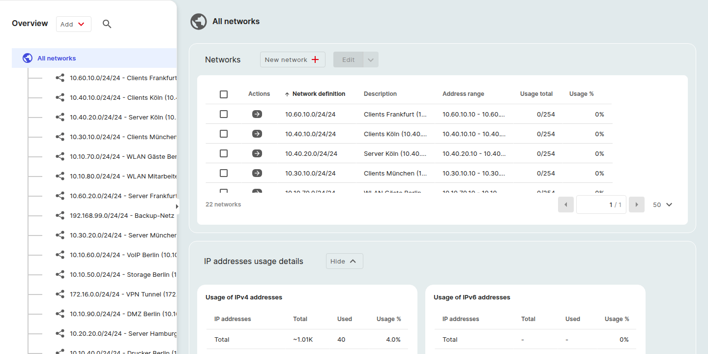

# IP-Adressverwaltung

Ein **Netzwerk**-Objekt dokumentiert ein IP-Netzwerk, dessen Adressbereich, Standard-Router, DHCP-Bereiche sowie die darin zugewiesenen IP-Adressen.
Die Kategorie **IP-Adressen** eines Netzwerk-Objekts listet alle Adressen im Netzwerk auf und ermöglicht es Ihnen, diese zuzuweisen oder die Zuweisung aufzuheben.

Informationen zur Kategorie „pro Objekt“, bei der *eine* Adresse auf einem Server oder einem anderen Gerät erfasst wird, finden Sie unter [IP-Netzwerke](ip-networking.md).

## Übersicht über alle Netzwerke

Öffnen Sie oben auf der Seite **Bestand > Netzwerke**, um eine mandantenweite Übersicht über alle Netzwerke und deren IP-Nutzung anzuzeigen.

Die Seite besteht aus zwei Teilen:

### Tabelle „Netzwerke“

Eine Tabelle aller Netzwerkobjekte mit folgenden Spalten:

| Spalte | Anmerkungen |
|---|---|
| **Aktionen** | Zeilenbezogene Aktionen, einschließlich des Aufrufs der Netzwerkdetailseite. |
| **Netzwerkdefinition** | Name und Adressbereich des Netzwerks. Klicken Sie auf die Spaltenüberschrift, um zu sortieren. |
| **Beschreibung** | Freitextbeschreibung. |
| **Adressbereich** | Beginn bis Ende des Netzwerks. |
| **Gesamtnutzung** | Anzahl der derzeit innerhalb des Netzwerks genutzten Adressen. |
| **Nutzung in %** | Genutzte Adressen als Prozentsatz des gesamten Bereichs. |

Verwenden Sie **Neues Netzwerk +** oberhalb der Tabelle, um ein Netzwerk anzulegen, oder **Bearbeiten ⌄** für Sammelaktionen an ausgewählten Zeilen.
Die linke Seitenleiste bildet die Tabelle als hierarchische Baumstruktur unter **Alle Netzwerke** ab; durch Klicken auf ein übergeordnetes Netzwerk gelangen Sie zu dessen Unternetzwerken.

### Details zur Nutzung von IP-Adressen

Unterhalb der Tabelle werden im ausblendbaren Abschnitt „**Details zur Nutzung von IP-Adressen**“ die gleichen Nutzungszahlen nach Adressversion in zwei nebeneinander angeordnete Bereiche unterteilt:

- **Verwendung von IPv4-Adressen**
- **Verwendung von IPv6-Adressen**

Jedes Feld zeigt drei Zeilen an: **Gesamt**, **In DHCP-Bereichen**, **Nicht in DHCP-Bereichen**, mit den Spalten **Gesamt**, **Verwendet** und **Auslastung in %**.
Verwenden Sie die Umschaltfläche **Ausblenden ⌄** / **Einblenden ⌄**, um den Abschnitt ein- oder auszublenden.

## Netzwerk-Detailseite

Klicken Sie in der Seitenleiste unter „Alle Netzwerke“ (oder auf den Zeilenpfeil in der Tabelle) auf ein Netzwerk, um dessen Detailseite zu öffnen.

In der Kopfzeile der Seite werden der Netzwerkname, die Klassenbezeichnung und der Adressbereich (z. B. *Netzwerk (10.10.10.0 bis 10.10.10.255)*) sowie ein kleines Symbol **„In neuem Fenster öffnen“** angezeigt, das zur vollständigen, nach Kategorien geordneten Detailseite des Objekts führt.

Unter der Kopfzeile befinden sich drei Registerkarten:

- **IP-Adressen**: dieselbe Tabelle, die oben unter *IP-Adressentabelle öffnen* beschrieben wurde.
    Nachdem eine Netzwerkdefinition gespeichert wurde, wird die Tabelle automatisch mit reservierten Einträgen (der Netzwerkadresse selbst, dem Standard-Router und der Broadcast-Adresse) sowie allen von Ihnen zugewiesenen Adressen vorbelegt.
    Jede Zeile verfügt über eine Bleistift-Schaltfläche zum **Bearbeiten**; die Spalte **Konfiguration** zeigt einen farbigen Indikator (z. B. einen schwarzen Balken für *Netzwerkadresse*) sowie einen Statustext an.
- **DHCP-Bereiche**: Für dieses Netzwerk definierte, von DHCP verwaltete Adressbereiche.
- **Netzwerke**: Die Subnetze des Netzwerks.

### Registerkarte „Netzwerke“ (Subnetze)

Auf der Registerkarte **Netzwerke** einer Netzwerkdetailseite werden alle Netzwerkobjekte aufgelistet, deren Adressbereich innerhalb des übergeordneten Netzwerks liegt.
Ein Subnetzwerk ist ein ganz normales Netzwerkobjekt; es verfügt über eine eigene *Netzwerkdefinition*, eine IP-Adressentabelle und ein Donut-Diagramm.

Die Registerkarte zeigt dieselben Spalten wie die Tabelle „Alle Netzwerke“:

| Spalte | Anmerkungen |
|---|---|
| **Aktionen** | Zeilenbezogene Aktionen, einschließlich des Aufrufs der Detailseite des Teilnetzwerks. |
| **Netzwerkdefinition** | Name und Adressbereich des Subnetzes. |
| **Adressbereich** | Start- bis Endpunkt des Subnetzes. |
| **Gesamtnutzung** | Anzahl der derzeit innerhalb des Subnetzes genutzten Adressen. |
| **Nutzungsanteil** | Genutzte Adressen als Prozentsatz des Subnetzbereichs. |

Über die Schaltfläche **Neues Netzwerk +** oberhalb der Tabelle können Sie ein untergeordnetes Netzwerk erstellen.
Der Adressbereich des übergeordneten Netzwerks wird in der Definition des neuen Netzwerks bereits vorausgefüllt, sodass Sie ihn nur noch eingrenzen müssen.

Die gleiche Hierarchie wird in der linken Seitenleiste „**Alle Netzwerke**“ in der Gesamtübersicht der Netzwerke angezeigt: Durch Klicken auf ein übergeordnetes Netzwerk werden dessen Unternetzwerke erweitert; durch Klicken auf ein Endelement wird dessen Detailseite geöffnet.

### Nutzungsdetails (mit Donut-Chart)

Unterhalb der Tabelle auf der Registerkarte *IP-Adressen* befindet sich der Abschnitt **Nutzungsdetails**, der als einziger Bereich in IPAM eine grafische Darstellung bietet:

- Eine Tabelle **Verwendung von IP-Adressen** mit den Zeilen **Gesamt**, **In DHCP-Bereichen**, **Nicht in DHCP-Bereichen** und den Spalten **IP-Adressen** / **Gesamt** / **Verwendet** / **Verwendungsanteil**.
- Ein **Donut-Chart** auf der rechten Seite, das dieselbe Aufschlüsselung visualisiert.
    Die Legende des Diagramms entspricht den Zeilen der Tabelle; die Segmente füllen sich, sobald Adressen zugewiesen werden, sodass ein leeres Netzwerk im Diagramm in einer einzigen neutralen Farbe dargestellt wird, während ein belegtes Netzwerk für jede Zeile eigene Segmente anzeigt.
- Ein Umschaltknopf **Ausblenden ⌄** / **Einblenden ⌄** in der Abschnittsüberschrift blendet das gesamte Fenster ein oder aus.

## Rechte

Sie können IP-Adressen für jedes Netzwerkobjekt verwalten, auf das Sie Schreibzugriff haben.
Siehe [Rechte und Berechtigungen](../../admin/rights-and-permissions.md).

## Die Tabelle mit den IP-Adressen öffnen

1. Öffnen Sie ein Netzwerkobjekt, indem Sie beispielsweise die Klasse **Netzwerk** aus der Dropdown-Liste *Alle Klassen* oberhalb der Finder-Tabelle auswählen und auf einen Eintrag klicken.
2. Wählen Sie in der Seitenleiste „Kategorien“ des Objekts (unter **Alle Kategorien**) die Option **IP-Adressen** aus.

## Die Definition des Netzwerks ist eine Voraussetzung

Bevor IP-Adressen in einem Netzwerkobjekt vorhanden sein können, muss das Netzwerk selbst beschrieben werden.
Wenn die Kategorie **Netzwerkdefinition** leer ist, wird in der IP-Adressentabelle folgende Eingabeaufforderung angezeigt:

> *Netzwerkdefinition fehlt. Bitte geben Sie zunächst die Netzwerkdefinition ein, um IP-Adressen erstellen zu können.*

Die Schaltflächen **Hinzufügen +** und **Zuordnung aufheben** bleiben deaktiviert, bis eine Netzwerkdefinition gespeichert wurde.
Klicken Sie in der Eingabeaufforderung auf **Hinzufügen** (oder öffnen Sie die Kategorie **Netzwerkdefinition** in der Seitenleiste), um folgende Angaben einzugeben:

- **Abschnitt**: Die Adressklasse oder Zone, zu der das Netzwerk gehört.
- **Version**: IPv4 oder IPv6.
- **Netzwerkadresse**: Die Basisadresse des Netzwerks.
- **Subnetzmaske**: Die CIDR-Adresse des Netzwerks.
- **Standard-Router**: Die als Standard-Gateway reservierte IP-Adresse.

Nachdem die Definition gespeichert wurde, wird die IP-Adressentabelle aktiviert.

## Was die Tabelle zeigt

Sobald die Netzwerkdefinition eingerichtet ist, enthält die Tabelle folgende Spalten:

| Spalte | Anmerkungen |
|---|---|
| (Kontrollkästchen) | Wählt Zeilen für die Aktion **Zuordnung aufheben** aus. |
| **Aktionen** | Aktionen pro Zeile. |
| **IP-Adresse** | Die Adresse. Klicken Sie auf die Spaltenüberschrift, um zu sortieren. |
| **Konfiguration** | Wie die Adresse konfiguriert ist (z. B. *Statisch*). |
| **Objekte** | Das Objekt oder die Objekte, denen die Adresse zugewiesen ist. |

Die Tabelle ist am unteren Rand paginiert; ein Seitengrößen-Selektor steuert, wie viele Einträge pro Seite angezeigt werden.

Über dem rechten Rand der Tabelle befinden sich zwei Filtersteuerelemente:

- **Alle IP-Adressen ⌄**: Filtert die Tabellenansicht (beispielsweise, um nur zugewiesene, nicht zugewiesene oder gruppierte leere Bereiche anzuzeigen).
- **Bereiche aufklappen ↕**: Legt fest, ob nicht zugewiesene Bereiche als eine Zeile pro Bereich oder als einzelne Adressen aufgeklappt angezeigt werden.

## Eine IP-Adresse zuweisen

1. Bewegen Sie den Mauszeiger über die Zeile einer nicht zugewiesenen Adresse (oder eines nicht zugewiesenen Bereichs).
2. Klicken Sie in der Zelle **Aktionen** der Zeile auf **Bearbeiten**.
3. Geben Sie im Modalfenster **IP-Adresse bearbeiten** das **Objekt** ein, zu dem die Adresse gehört, sowie die **Konfiguration** (z. B. *Statisch zugewiesen*).
4. Klicken Sie auf **Speichern**.

## Eine oder mehrere Adressen freigeben

1. Markieren Sie die Adressen, deren Zuordnung Sie aufheben möchten, über die entsprechenden Kontrollkästchen.
2. Klicken Sie oberhalb der Tabelle auf **Zuordnung aufheben**.
3. Bestätigen Sie im Dialogfeld.

Die Schaltfläche ist deaktiviert, bis mindestens eine Zeile ausgewählt ist.
Bereits nicht zugewiesene Zeilen in Ihrer Auswahl werden ignoriert.

## Verwandte Kategorien eines Netzwerkobjekts

Neben **IP-Adressen** und **Netzwerkdefinition** stellt ein Netzwerkobjekt Folgendes bereit:

- **DHCP-Bereiche**: Von DHCP verwaltete Adressbereiche.
- **Subnetze**: Unternetze, die zu diesem Netzwerk gehören.

## Siehe auch

- [IP-Netzwerk](ip-networking.md), die objektbezogene Kategorie, in der eine individuelle Adresse auf einem Server oder einem anderen Gerät gespeichert wird.
- [Objekte](objects.md)
- [Kategorien und Attribute](categories-and-attributes.md)
