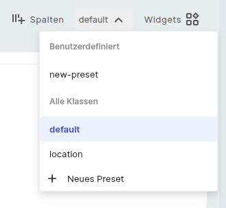

# Ansichten und Presets

{:target="_blank"}

Der `Finder` zeigt Ihre Dokumentation in Form von benutzerdefinierten Tabellen an. Diese Tabellen bieten verschiedene Ansichten auf die dokumentierten Daten. Die aktuelle Ansicht auf die Daten kann durch Hinzufügen, Entfernen oder Neuanordnen von [Attribut](../basics/categories-and-attributes.md)-Spalten angepasst werden.

Wenn Sie mit Ihrer Spaltenauswahl zufrieden sind, können Sie diese als `Preset` speichern. Presets haben entweder einen Klassen- oder einen globalen Kontext. Presets lassen sich auch über die [Einstellungen] erstellen.

## Klassenkontext

Ein Klassenkontext bedeutet, dass der Benutzer eine bestimmte `Preset` für eine bestimmte [Klasse](../basics/classes.md) haben kann, z. B. eine `Preset` für Server zeigt IP-Adressen und Festplatten an, während eine `Preset` für Personen vollständige Namen und E-Mail-Adressen anzeigt.

## Globaler Kontext

Wenn eine `Ansichtseinstellung` einen globalen Kontext hat, kann sie für alle Klassen verwendet werden oder wenn Sie Objekte aus verschiedenen Klassen betrachten. Dies ist nützlich, um [Suchergebnisse](search-filters-and-reports.md) anzuzeigen.

## Klassen oder Speicherorte

In der Navigationsleiste oben können Sie zwischen der Ansicht `Finder`, `Standorte` und `Netzwerke` wechseln. Dieser Wechsel ändert die Art und Weise, wie Sie durch Ihre Informationen navigieren, vollständig. Für diese Ansichten können Sie unten eine Paginierung verwenden. Hier können Sie die Ergebnisse pro Seite festlegen und die gewünschte Seite auswählen.
