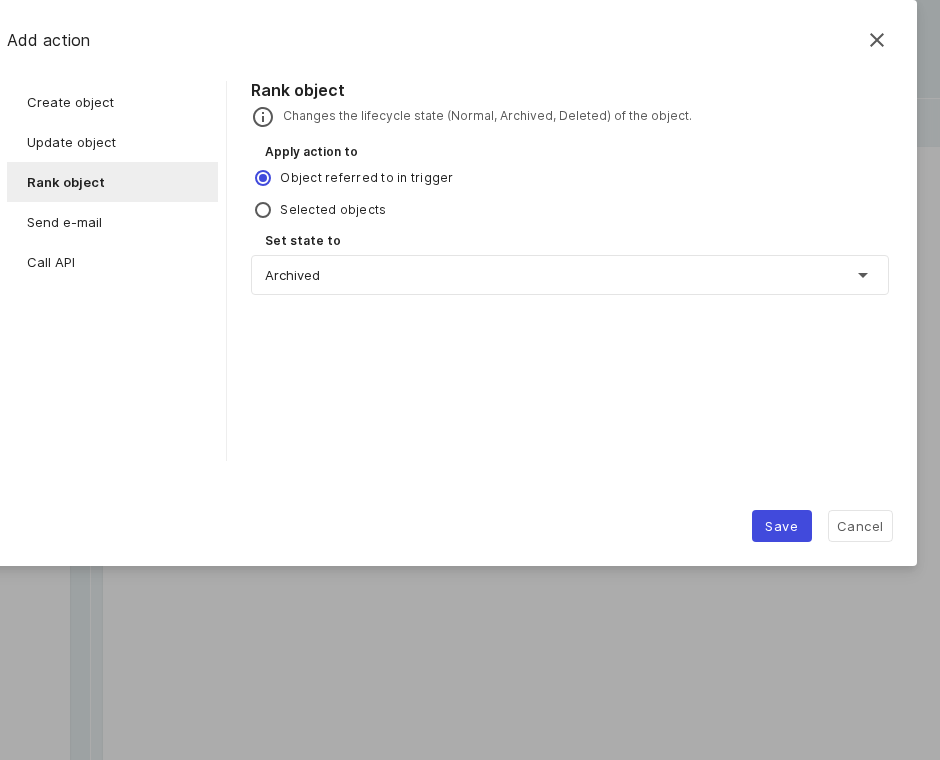

# Aktionen – Anwendungsfälle

Eine Aktion kann ein Objekt anlegen, aktualisieren oder einstufen, eine E-Mail senden oder eine externe API
aufrufen. Mehrere Aktionen laufen der Reihe nach. Die vollständige Referenz finden Sie unter
[Auslöser, Bedingungen und Aktionen](reference.md).

## Objekt anlegen: ein Notebook mit sprechendem Namen

**Szenario:** Der Button-Flow legt ein Notebook an, dessen Titel einen Zähler und das Auslöser-Objekt
enthält.

- Wählen Sie die Aktion **Objekt anlegen** und die **Objektklasse** aus der durchsuchbaren Liste (jede Option
  zeigt ihr Typ-Icon).
- Setzen Sie den **Objekttitel** mit Platzhaltern, zum Beispiel `Notebook {{counter}} für {{object-name}}`.
- Setzen Sie Felder über **Attribute hinzufügen** (der Attribut-Picker gruppiert sie nach Kategorie).

**Objekt anlegen:** Objektklasse, ein Titel mit Platzhaltern und die Attributauswahl.

## Objekt aktualisieren: ein Prüfdatum stempeln

**Szenario:** Bei einer Kategorie-Änderung soll ein Datum „zuletzt geprüft“ gesetzt werden.

- Wählen Sie die Aktion **Objekt aktualisieren**. Wählen Sie unter **Aktion anwenden auf** entweder
  **Im Auslöser referenziertes Objekt** (Standard) oder **Ausgewählte Objekte**.
- Wählen Sie Attribute über den Picker; bei Datumsfeldern setzen Sie **Datum der Ausführung verwenden**. Eine
  Mehrwert-Kategorie erhält pro Lauf einen neuen Eintrag.

**Objekt aktualisieren:** das Ziel (Auslöser-Objekt oder ausgewählte Objekte) und dessen Attribute.

## Objekt einstufen: ein ausgemustertes Gerät archivieren

**Szenario:** Ein Button setzt ein ausgemustertes Gerät auf den Lifecycle-Zustand „archiviert“.

- Wählen Sie die Aktion **Objekt einstufen** und das Ziel (Auslöser-Objekt oder ausgewählte Objekte).
- Setzen Sie **Zustand setzen auf** — normal, archiviert oder gelöscht.

**Objekt einstufen:** der Lifecycle-Zustand (normal, archiviert oder gelöscht).

## E-Mail senden: den Service-Desk benachrichtigen

**Szenario:** Ein zeitbasierter Flow sendet eine formatierte Erinnerung.

- Wählen Sie die Aktion **E-Mail senden** und setzen Sie **Empfänger** (kommagetrennt) und einen **Betreff**
  (beides Pflicht).
- Schreiben Sie den **Text** im Markdown-Editor — links die Eingabe, rechts die Live-Vorschau. Betreff und
  Text akzeptieren Platzhalter.

**E-Mail senden:** Empfänger, Betreff und ein Markdown-Editor mit Vorschau.

!!! note
    Der SMTP-Versand wird serverseitig konfiguriert (`SMTP_URL` und `MAIL_FROM`); es gibt keine Einstellung
    je Instanz.

## API aufrufen: ein externes System per Webhook informieren

**Szenario:** Ein neu angelegtes Objekt wird per HTTP-POST an ein anderes System gemeldet.

- Wählen Sie die Aktion **API aufrufen** und setzen Sie die **Methode** (GET, POST, PUT, PATCH, DELETE) und
  die **URL**.
- Füllen Sie den **Body** mit Platzhaltern, zum Beispiel `{"neu":"{{object-name}}","id":"{{object-id}}"}`.
  Ausgehende Aufrufe lassen sich über einen Proxy leiten.

**API aufrufen:** die Methode, die URL und ein optionaler Body mit Platzhaltern.

## Weiterführende Themen

- [Auslöser – Anwendungsfälle](triggers.md)
- [Durchgängiges Beispiel](end-to-end.md)
