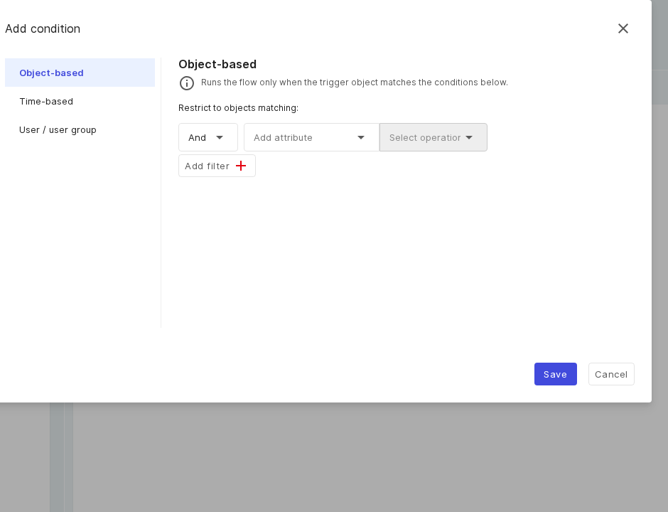

# Bedingungen – Anwendungsfälle

Bedingungen sind optional und müssen _alle_ erfüllt sein. Ist eine nicht erfüllt, wird der Lauf als
_Übersprungen_ mit Begründung im Log festgehalten. Die vollständige Referenz finden Sie unter
[Auslöser, Bedingungen und Aktionen](reference.md).

## Objektbasiert: nur für Objekte in Betrieb

**Szenario:** Ein Flow soll nur laufen, wenn das Auslöser-Objekt einen bestimmten CMDB-Status oder
Attributwert hat.

- Wählen Sie die Bedingung **Objektbasiert**.
- Bauen Sie eine Regel im Filterbauer mit **Filter hinzufügen** und **Operation wählen** (zum Beispiel „CMDB-Status ist in Betrieb“); mehrere Filter werden mit _Und_ verknüpft.

**Objektbasierte Bedingung:** ein visueller Filterbauer mit _Und_-Verknüpfung und Operationen.

## Zeitbasiert: nur während der Geschäftszeiten

**Szenario:** Der Flow soll nur montags bis freitags zwischen 08:00 und 16:00 laufen.

- Wählen Sie die Bedingung **Zeitbasiert**.
- Wählen Sie die Wochentage (keine Auswahl bedeutet jeden Tag) und setzen Sie die Zeiten **Von** und **Bis**.
- Ergänzen Sie weitere Fenster mit **Zeitfenster hinzufügen**.

**Zeitbasierte Bedingung:** Wochentage plus ein Von/Bis-Zeitfenster.

## Benutzer / Benutzergruppe: nur bestimmte Personen zulassen

**Szenario:** Der Flow soll nur laufen, wenn ein Mitglied der Gruppe „IT-Team“ ihn auslöst.

- Wählen Sie die Bedingung **Benutzer / Benutzergruppe**.
- Wählen Sie Benutzer und Benutzergruppen aus der Liste (die Gruppenmitgliedschaft wird automatisch aufgelöst).

**Benutzer- / Benutzergruppen-Bedingung:** grenzt ein, wer den Flow auslösen darf.

!!! note
    Bei Button-Flows wird der Button für Personen ausgeblendet, die die Personen-Bedingung nie erfüllen
    können. Bei objektbasierten und zeitbasierten Bedingungen bleibt der Button sichtbar, aber inaktiv, mit
    einem Tooltip, der den Grund erklärt.

## Weiterführende Themen

- [Auslöser – Anwendungsfälle](triggers.md)
- [Aktionen – Anwendungsfälle](actions.md)
