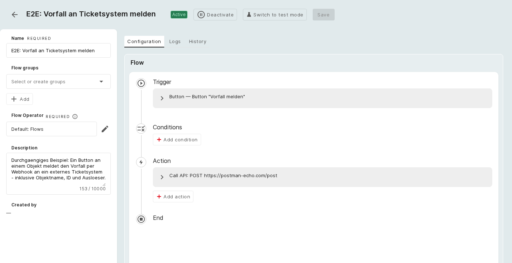

# Durchgängiges Beispiel

Dieses Kapitel führt einen vollständigen Flow von der Anlage bis zur protokollierten Ausführung durch.

**Szenario:** An jeder Objektansicht erscheint ein Button **Vorfall melden**. Ein Klick meldet den Vorfall per
Webhook (HTTP-POST) an ein externes Ticketsystem und übergibt Objektname, Objekt-ID, die meldende Person und
eine fortlaufende Ticketnummer.

## Schritt 1: Flow anlegen

Wählen Sie in der Übersicht **Flow hinzufügen**, geben Sie den Namen „Vorfall an Ticketsystem melden“ ein und
ergänzen Sie eine Beschreibung.

## Schritt 2: Auslöser konfigurieren

Wählen Sie den Auslöser **Button** mit **Button-Name** „Vorfall melden“, der Button-Gruppe „Service-Desk“ und
der Platzierung **Alle Objekte** (der Button erscheint an jedem Objekt).

## Schritt 3: Aktion konfigurieren

Wählen Sie die Aktion **API aufrufen**, Methode **POST**, die URL des Ticketsystems und einen Body mit
Platzhaltern:

```json
{ "objekt": "{{object-name}}", "id": "{{object-id}}",
  "gemeldet_von": "{{users-name}}", "ticket": "#{{counter}}" }
```

## Schritt 4: speichern und aktivieren

Der fertige Flow zeigt die lineare Kette **Auslöser → Bedingungen → Aktion → Ende**. Mit **Aktivieren**
schalten Sie ihn scharf (Status _Aktiv_).

[](../../img/screenshots/flows/end-to-end-flow.png)
**Aktivierter Flow:** der durchgängige Flow mit Button-Auslöser und einer Aktion API aufrufen.

## Schritt 5: auslösen und Ergebnis prüfen

Ein Klick auf den Button **Vorfall melden** an einem Objekt startet den Flow. Unter **Logs** erscheint der
Lauf mit Status _Erfolg_; die Detailansicht zeigt Zeitpunkt, meldende Person, Auslöser-Objekt und die
ausgeführte Aktion.

[](../../img/screenshots/flows/end-to-end-logs.png)
**Protokollierter Lauf:** ein erfolgreicher, per Button ausgelöster Aufruf, festgehalten mit Auslöser-Objekt
und auslösender Person.

## Aktivieren, Testmodus und Logs

Ein gespeicherter Flow ist zunächst _Inaktiv_. In der Detailansicht schaltet **Aktivieren** ihn scharf, und
**In Testmodus wechseln** führt ihn in einem neutralen Zustand aus, in dem Aktionen nur simuliert werden.
Jeder Lauf wird unter **Logs** mit Zeitpunkt, Status (Erfolg, übersprungen oder Fehler) und Begründung
festgehalten.

!!! note
    Aktionen, die die CMDB verändern (Objekt anlegen, aktualisieren oder einstufen), laufen als _Flow-User_.
    Damit sie greifen, benötigt dieser einmalig die nötigen Objektrechte (Opt-in unter **Flow-Users**).
    Webhook- und E-Mail-Aktionen wie oben benötigen keine CMDB-Schreibrechte.

## Weiterführende Themen

- [Flows-Überblick](index.md)
- [Aktionen – Anwendungsfälle](actions.md)
