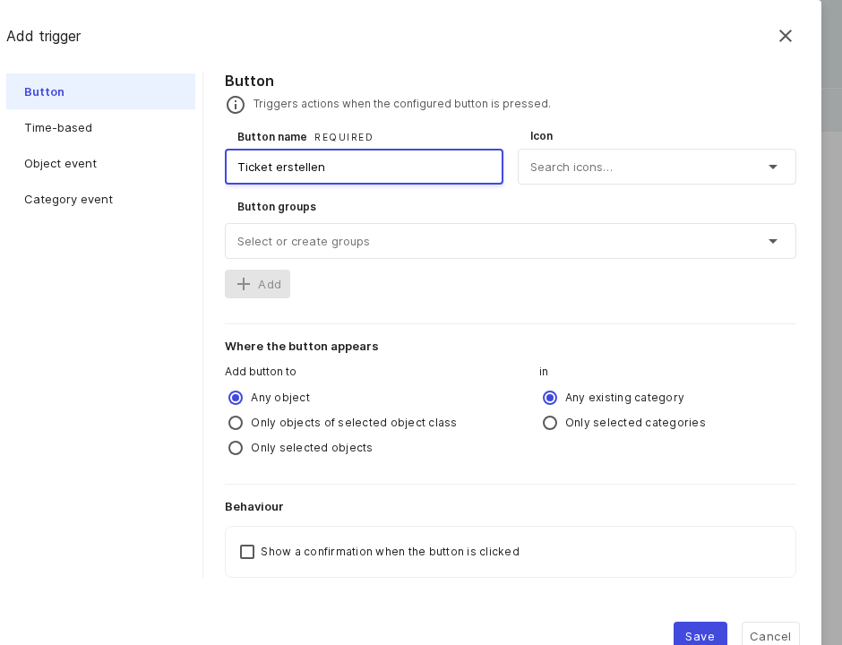
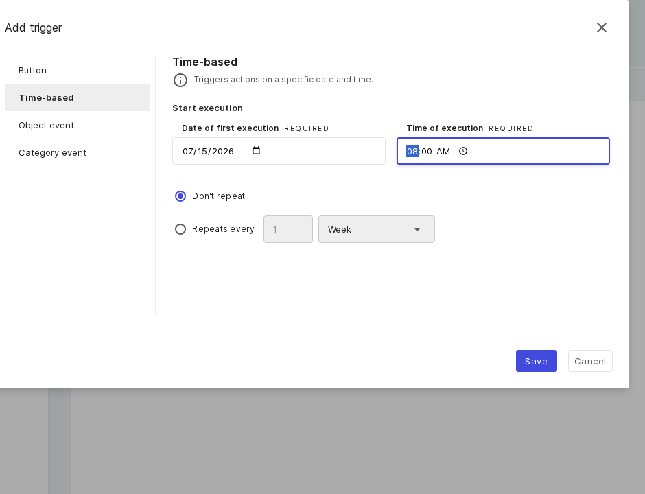
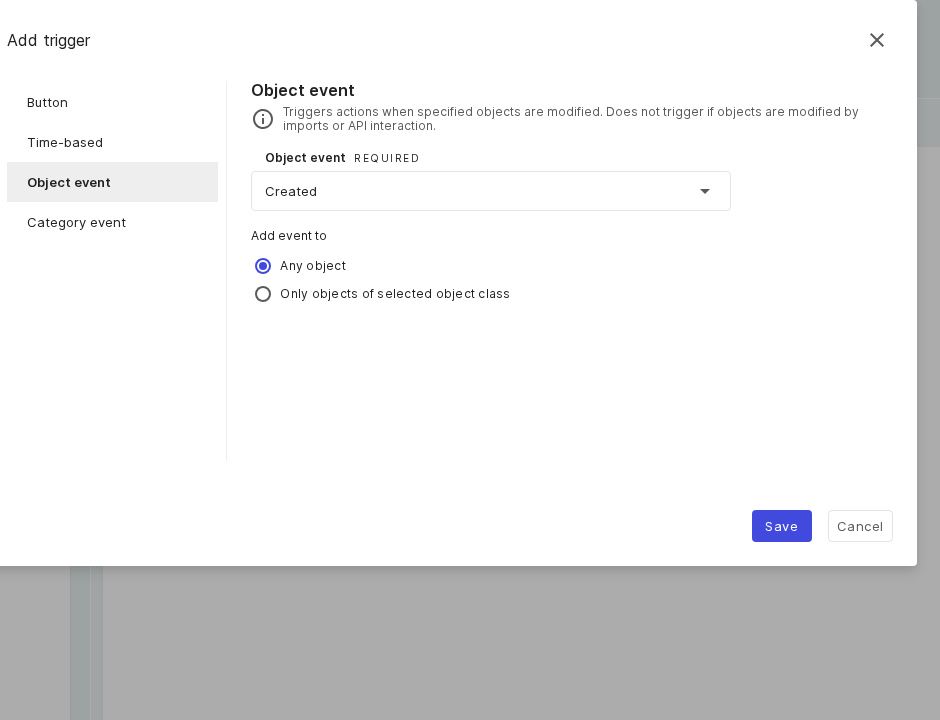
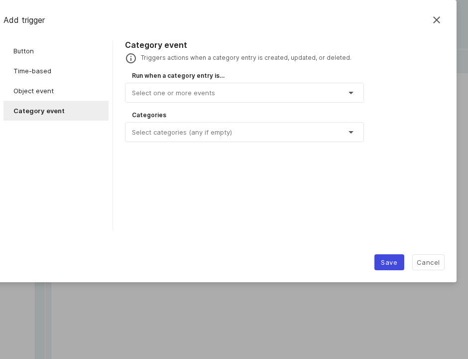

# Auslöser – Anwendungsfälle

Ein Flow kann durch einen **Button**, einen **zeitbasierten** Zeitplan, ein **Objekt-Ereignis** oder ein
**Kategorie-Ereignis** gestartet werden. Jedes Beispiel zeigt ein realistisches Szenario und die passende
Konfiguration. Die vollständige Referenz finden Sie unter
[Auslöser, Bedingungen und Aktionen](reference.md).

## Button: Notebook an einem Personen-Objekt anlegen

**Szenario:** Beim Onboarding möchte das IT-Team an einem Personen-Objekt mit einem Klick ein neues Notebook
anlegen.

- Wählen Sie den Auslöser **Button** und setzen Sie **Button-Name** auf „Notebook ausgeben“.
- Vergeben Sie optional eine Button-Gruppe („IT-Onboarding“) und ein Icon.
- Legen Sie unter **Wo der Button erscheint** die Sichtbarkeit fest: alle Objekte, ausgewählte Objektklassen oder ausgewählte Objekte — und optional bestimmte Kategorie-Ansichten.

**Button-Auslöser:** Name, Icon, Gruppen sowie Platzierungs- und Sichtbarkeitsoptionen.

## Zeitbasiert: ein wöchentlicher Wartungsbericht

**Szenario:** Jeden Montag um 08:00 soll eine automatische Erinnerung an den Service-Desk gehen.

- Wählen Sie den Auslöser **Zeitbasiert** und setzen Sie **Datum der ersten Ausführung** und **Uhrzeit der Ausführung**.
- Aktivieren Sie **Wiederholen alle** mit Intervall **1** und Einheit **Woche**; bei Wochen erscheint eine Wochentagsauswahl.
- Für einen einmaligen Lauf lassen Sie stattdessen **Nicht wiederholen**.

**Zeitbasierter Auslöser:** Datum und Uhrzeit mit optionaler Wiederholung (Tag, Woche, Monat oder Jahr).

## Objekt-Ereignis: jedes neue Objekt an ein anderes System melden

**Szenario:** Sobald irgendwo ein Objekt angelegt wird, soll ein externes Compliance-System benachrichtigt
werden.

- Wählen Sie den Auslöser **Objekt-Ereignis** und das Ereignis **Angelegt** (weitere: geändert, gelöscht, archiviert, wiederhergestellt).
- Legen Sie unter **Ereignis anwenden auf** den Geltungsbereich fest: alle Objekte, ausgewählte Objektklassen oder ausgewählte Objekte (Letzteres nicht bei **Angelegt**).

**Objekt-Ereignis-Auslöser:** der Ereignistyp und der betroffene Objektumfang.

## Kategorie-Ereignis: auf Änderungen einer Kategorie reagieren

**Szenario:** Wenn ein Eintrag in der Netz-Kategorie angelegt oder geändert wird, soll ein Folgeschritt
laufen.

- Wählen Sie den Auslöser **Kategorie-Ereignis** und die Ereignisse (angelegt, geändert, gelöscht) unter **Wenn ein Kategorie-Eintrag …**.
- Begrenzen Sie **Kategorien** (leer bedeutet jede Kategorie); ergänzen Sie danach einzelne **Attribute** als Bedingung (bei angelegt und geändert).

**Kategorie-Ereignis-Auslöser:** Ereignisse und der Kategorie- oder Attributumfang.

!!! warning
    Vermeiden Sie Endlosschleifen. Ein Ereignis-Flow, der Objekte anlegt oder ändert, erzeugt neue
    Ereignisse. Das Add-on ignoriert die soeben selbst verursachte Änderung, dennoch sollten Sie
    Ereignis-Flows mit Bedingungen eingrenzen.

## Weiterführende Themen

- [Bedingungen – Anwendungsfälle](conditions.md)
- [Aktionen – Anwendungsfälle](actions.md)
- [Durchgängiges Beispiel](end-to-end.md)
