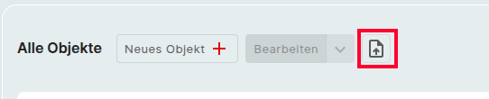

# CSV-Import

Mit dem CSV-Import können Sie beliebige CSV-Dateien in i-doit up hochladen und importieren. CSV steht für "Comma Separated Values" (durch Kommas getrennte Werte).

## Voraussetzungen

- Eine CSV-Datei darf nicht größer als 128 MB sein.
- Eine CSV-Datei sollte weniger als 250 Zeilen enthalten.
- Eine Objektklasse pro CSV-Datei.
- Die Berechtigung zum Importieren.

## Schritt 1

In der Symbolleiste finden Sie das Symbol "Aus CSV-Datei importieren", mit dem Sie den CSV-Importdialog öffnen können. Dieser Dialog führt Sie in sechs Schritten durch den Importvorgang. Hier können Sie eine gültige CSV-Datei auswählen und hochladen. Nach erfolgreichem Hochladen können Sie mit Schritt 2 fortfahren.

{:target="_blank"}

## Schritt 2

Im zweiten Schritt können Sie festlegen, ob Ihre CSV-Datei eine Kopfzeile enthält. Außerdem können Sie angeben, ob Ihre CSV-Datei Semikolon [;] oder Komma [,] als Trennzeichen verwendet. Eine kleine Vorschau ermöglicht Ihnen, Ihre Einstellungen zu überprüfen.

## Schritt 3

Im dritten Schritt geben Sie die Klasse an. Für jeden Import kann nur eine Klasse ausgewählt werden.

## Schritt 4

In Schritt 4 erhält jede Spalte eine eigene Zeile in der Zuordnung. So kann jede Zeile der CSV-Datei mit einem Attribut verknüpft werden. Nach Klicken auf die Schaltfläche "Hinzufügen" kann das entsprechende Attribut aus dem erweiterten Dialogmenü ausgewählt oder sein Name direkt in die Suchleiste eingegeben werden, um passende Attribute vorschlagen zu lassen.

Wählen Sie nun das entsprechende Attribut aus und klicken Sie auf "Speichern", um die Auswahl zu bestätigen. Auf diese Weise werden alle Spalten zugeordnet, bis alle Zuordnungen abgeschlossen sind. Zuordnungen können später gelöst werden. Spalten ohne Zuordnung werden beim Import ignoriert.

## Schritt 5

Hier können Sie optional auswählen, ob Sie bereits vorhandene Objekte "aktualisieren" oder nur "neue Objekte erstellen" möchten. Wenn Sie Objekte aktualisieren möchten, sollten Sie eine oder mehrere "Identifikatoren" hinzufügen, um vorhandene Objekte anhand eines qualifizierten zugewiesenen Attributs zuzuordnen. Nun müssen Sie auswählen, ob Sie vorhandene Werte in i-doit up "beibehalten" oder "löschen" möchten. Zuletzt legen Sie fest, ob bei Multi Value Kategorien "hinzugefügt" werden oder den vorhandenen Inhalt vollständig "ersetzen".

## Schritt 6

Im letzten Schritt wird eine Vorschau der Importzuordnung angezeigt. Wenn alles in Ordnung ist, können Sie den Import starten. Andernfalls können Sie zurückgehen und die erforderlichen Einstellungen ändern.
