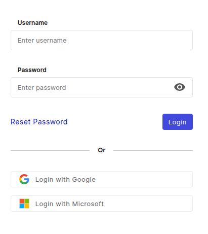

# Erste Anmeldung

Hier finden Sie eine Übersicht über die ersten Schritte bei der Anmeldung. Sie können mit dem folgenden URL-Schema auf Ihre i-doit up.cloud-Instanz zugreifen:

~~~
https://<Ihre_Subdomain>.docupike.cloud/
~~~

Ihre Subdomain wird bei der Bestellung einer i-doit up-Instanz von Ihrem Administrator angefordert und entspricht in der Regel dem Namen Ihrer Organisation. Wenn Sie die Subdomain Ihrer Organisation nicht kennen, wenden Sie sich an Ihren Administrator oder den [i-doit up Support][helpdesk].

Rufen Sie in Ihrem Webbrowser die Weboberfläche von i-doit up auf, um den Anmeldebildschirm anzuzeigen:

[helpdesk]: mailto:help@docupike.com

!!! note "Die Anmeldung mit Google oder Microsoft ist verfügbar, wenn Ihre E-Mail-Adresse mit einem Benutzer verknüpft ist."

!!! info "Keine Standardanmeldung"
    i-doit up hat keine Standard-Anmeldedaten. Stattdessen wird während der Installation automatisch der erste einzelne Benutzer angelegt. Sie erhalten eine E-Mail mit einem Link zum Erstellen eines Passworts. Dieser Benutzer hat die Administratorrolle mit allen Rechten und Berechtigungen.

!!! success "Passwort zurücksetzen"
    Wenn Sie Ihr Passwort vergessen haben oder es einfach ändern möchten, können Sie die Schaltfläche "Passwort zurücksetzen" auf dem Anmeldebildschirm verwenden.
