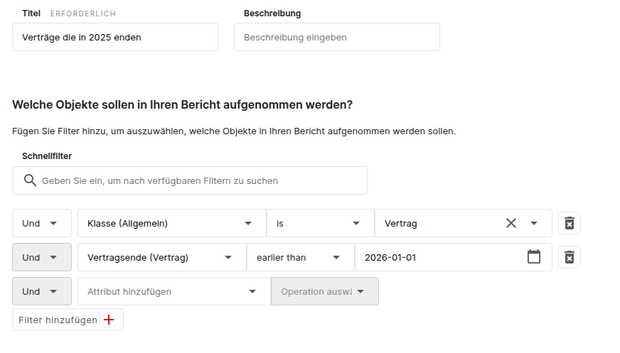
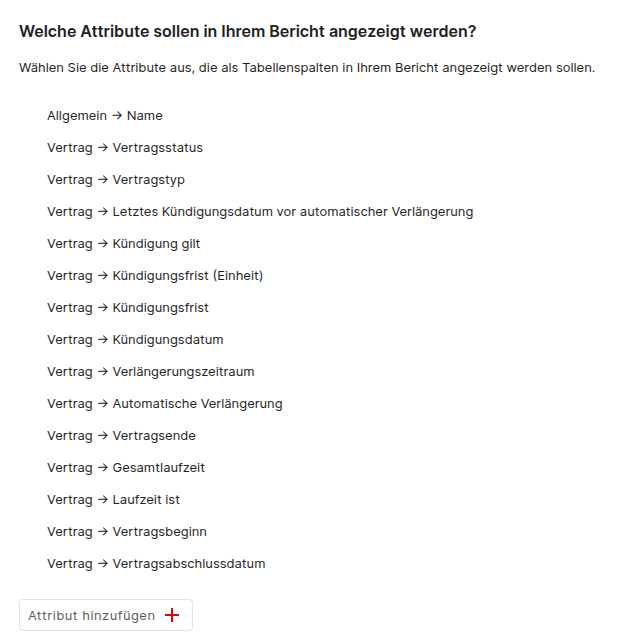
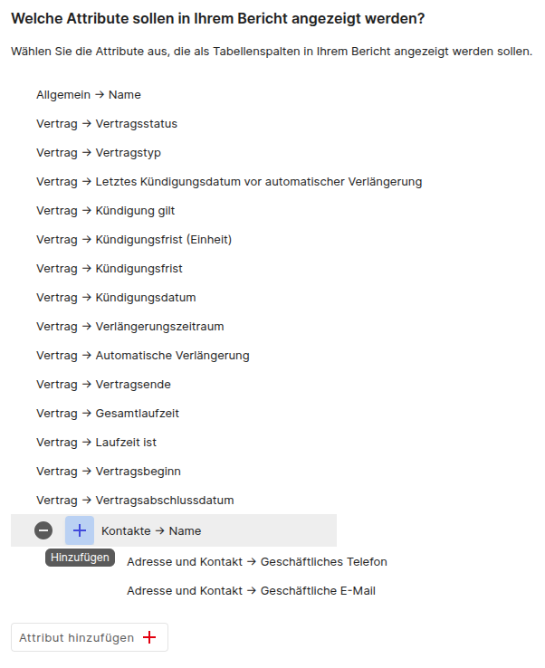
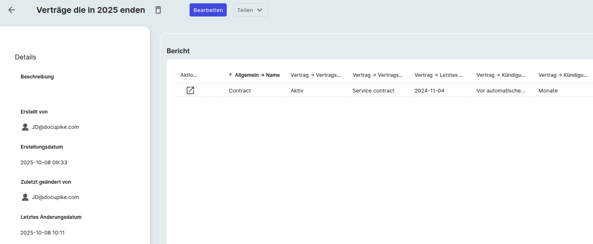

# Berichtsmanager

Mit der Berichtsfunktion können Sie viele nützliche Berichte erstellen. Klicken Sie dazu zunächst in der Menüleiste auf die Schaltfläche "Berichte" und wählen Sie "Berichtsmanager". Sie können einen Bericht erstellen, indem Sie auf "Hinzufügen" klicken. Als Beispiel erstellen wir einen Bericht über Verträge, die 2025 auslaufen. Zunächst erstellen wir einen Bericht und geben einen Titel ein, z. B. "Verträge die in 2025 enden". Als Nächstes legen wir fest, welche Objekte durch den Bericht gefiltert werden sollen. Dazu fügen wir `AND`- oder `OR`-Verbindungen hinzu. In diesem Beispiel verwenden wir `AND`-Bedingungen.

Wir möchten alle Objekte der Klasse "Vertrag", die 2025 auslaufen. Daher fügen wir die folgenden zwei Bedingungen hinzu:

{:target="_blank"}

Wenn Sie sich die Vorschau unten ansehen, werden Sie feststellen, dass nur die Namen der Verträge angezeigt werden. Um mehr zu sehen, können Sie die erforderlichen Attribute des Vertrags hinzufügen.

{:target="_blank"}

Darüber hinaus können Sie auch Informationen aus verwandten Objekten hinzufügen. Wenn Sie beispielsweise den Vertragspartner des Vertrags anzeigen möchten, können Sie das Attribut "Kontakte → Name" hinzufügen. Anschließend können Sie Attribute aus dem verwandten Objekt "Kontakt" hinzufügen.

{:target="_blank"}

Wenn Sie mit dem Ergebnis zufrieden sind, speichern Sie den Bericht und öffnen Sie ihn in der Berichtsansicht.

{:target="_blank"}
