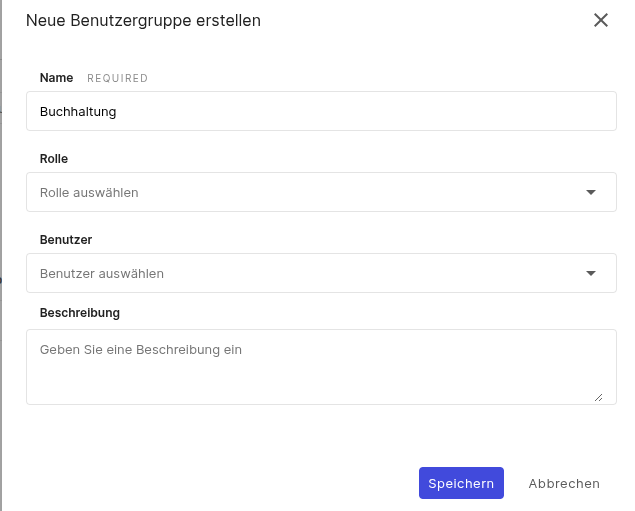
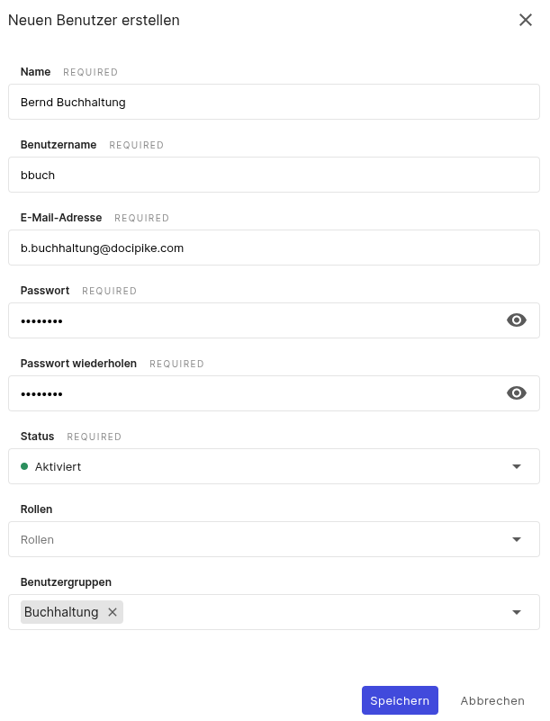

In diesem Anwendungsfall zeigen wir Ihnen, wie Sie Berechtigungen für verschiedene Benutzergruppen konfigurieren können. Der Zugriff auf Informationen muss in der Regel genau kontrolliert werden. Mit Docupike können Sie den Zugriff auf Informationen für Benutzer, Gruppen und sogar Rollen konfigurieren.

In diesem Anwendungsfall zeigen wir Ihnen, wie Sie den Zugriff für drei verschiedene Gruppen konfigurieren können.

**Fall 1:**

Unsere **Buchhaltungsabteilung** sollte Zugriff auf alle Vermögenswerte haben, aber nur Buchhaltungsdaten und den Standort der Geräte einsehen können. Auch Bearbeitungen durch die Buchhaltungsabteilung sollten nur in dieser Kategorie möglich sein.

**Fall 2:**

In der zweiten Gruppe sollen **externe Dienstleister** Zugriff auf die Informationen eines bestimmten Standorts erhalten. Der Zugriff auf Daten an anderen Standorten ist nicht gestattet.

**Fall 3:**

In Gruppe 3 sollten die **Anwendungsadministratoren** nur Objekte der Klasse "Server" bearbeiten können. Alle anderen Objekte sollten weder lesbar noch bearbeitbar sein.

# Fall 1: Zugriff auf Daten festlegen

Berechtigungen können für einzelne Benutzer, für definierte Rollen und Gruppen vergeben werden. Auch Kombinationen von Rollen und Gruppen sind möglich. Sowohl Rollen als auch Gruppen sind Container, denen Benutzer hinzugefügt werden können und für die **unterschiedliche Berechtigungen** vergeben werden können.

Wir erstellen nun eine neue Gruppe und eine Person, die Lesezugriff auf alle Objekte hat, aber nur Einträge in der Kategorie "Buchhaltung" sehen und bearbeiten kann.

Wir wechseln zu den Einstellungen und erstellen unter Benutzerverwaltung -> Benutzergruppen eine neue Gruppe mit dem Namen **"Buchhaltung"**. Hier werden wir später alle Benutzer hinzufügen, die in der Buchhaltung arbeiten.

<!--TODO{:target="_blank"}-->

Nun erstellen wir unter Benutzerverwaltung -> Benutzer einen **neuen Benutzer**.

<!--TODO{:target="_blank"}-->

Nun konfigurieren wir die Berechtigungen unter Benutzerverwaltung -> Berechtigungen. für die Benutzergruppe **"Buchhaltung"**. Diese sollte Buchhaltungsdaten lesen, erstellen und ändern können. Außerdem sollte sie den Standort von Anlagen ermitteln können. Alle anderen Informationen sollten für diese Gruppe nicht sichtbar sein.

Der erste Schritt besteht darin, den grundlegenden Zugriff auf Anlagen zu definieren. Zu diesem Zweck erstellen wir eine neue Berechtigung. Hier gewähren wir Lesezugriff auf alle Objekte in der Kategorie "Allgemein". Dies ist erforderlich, damit grundlegende Anlageninformationen wie der Name sichtbar sind.

<!--TODO{:target="_blank"}-->

Wir erstellen eine neue Berechtigung, die für "Kategorie- und Attributeinträge" gilt.

Als Benutzergruppe wählen wir "Buchhaltung" und als Geltungsbereich "Alle Objekte".

Jetzt erteilen wir für die Kategorie "Buchhaltung" für alle Attribute die Berechtigungen zum Erstellen, Lesen und Bearbeiten. Vorhandene Daten dürfen nicht gelöscht werden.

<!--TODO{:target="_blank"}-->

Zuletzt möchten wir noch die Leseberechtigung für den Standort der Geräte vergeben. Dies ist nicht unerheblich, da die Mitarbeiter der Buchhaltung auch überprüfen müssen, wo sich die Geräte befinden.

<!--TODO{:target="_blank"}-->

Damit ist die Konfiguration für die Benutzergruppe "Buchhaltung" abgeschlossen und wir können nun die Berechtigungen testen.

<!--TODO{:target="_blank"}-->

# Berechtigungen testen

Am einfachsten können Sie die Berechtigungen testen, indem Sie einen neuen Benutzer anlegen, ihn der entsprechenden Benutzergruppe hinzufügen und sich mit ihm anmelden. Wir melden uns mit unserem angelegten Benutzer "Alex Buchhaltung" an.

<!--TODO{:target="_blank"}-->

| **Test**                                                                                                                                                                                                                                                                         | **Ergebnis**                                                                                                                                                              |
| -------------------------------------------------------------------------------------------------------------------------------------------------------------------------------------------------------------------------------------------------------------------------------- | ------------------------------------------------------------------------------------------------------------------------------------------------------------------------- |
| Beim Versuch, ein neues Objekt in einer beliebigen Klasse zu erstellen oder zu löschen, wird die Meldung angezeigt, dass Sie nicht über ausreichende Berechtigungen für diese Aktion verfügen.                                                                                   | <!--TODO{:target="_blank"}--> |
| Beim Aufruf eines Objekts sollten nun nur noch die Kategorien "Allgemein", "Buchhaltung" und "Standort" Informationen anzeigen. Beim Versuch, die Kategorie "Standort" zu bearbeiten, sollte angezeigt werden, dass der Benutzer nicht über ausreichende Berechtigungen verfügt. | <!--TODO{:target="_blank"}-->            |

!!!info
    **Unterschied zwischen Rechten und Berechtigungen:** docupike unterscheidet zwischen funktionalen _Rechten_ und _Berechtigungen_ für den Zugriff auf bestimmte Informationen in der Dokumentation.
    **Rechte:** Ein Recht ermöglicht es einem Benutzer, eine bestimmte Funktion zu nutzen oder administrative Einstellungen vorzunehmen.
    **Berechtigung:** Eine Berechtigung gewährt einem Benutzer Zugriff auf einen bestimmten Satz dokumentierter Informationen. |

Beim Zugriff auf Kategorien, für die keine Berechtigungen konfiguriert wurden, wird anstelle der Informationen nur die Meldung "Keine Berechtigung" angezeigt.

<!--TODO{:target="_blank"}-->

# Fall 2: Zugriff auf Informationen für externe Parteien freigeben

In einigen Fällen möchten Sie möglicherweise externen Dienstleistern oder anderen Unternehmen Zugriff auf Informationen gewähren. Dazu können Sie einfach eine separate Gruppe in docupike erstellen und spezielle Berechtigungen dafür konfigurieren.

Wir erstellen eine neue Gruppe für "Externe" in Benutzergruppen.

<!--TODO{:target="_blank"}-->

Nun konfigurieren wir die Berechtigung für diese neue Benutzergruppe. Dazu wechseln wir zum Menüpunkt Berechtigungen.

Hier **erstellen wir eine neue Berechtigung** für die Gruppe Externe über die Schaltfläche "Neue Berechtigung".

Sie können einen bestimmten Standort auswählen und dann konfigurieren, ob auch alle untergeordneten Standorte einbezogen werden sollen (z. B. Zweigstelle + alle zugehörigen Räume).

<!--TODO{:target="_blank"}-->

# Fall 3: Zugriff auf bestimmte Klassen

In einigen Fällen möchten Sie möglicherweise, dass Personen oder Gruppen nur Zugriff auf bestimmte Klassen haben. In diesem Fall können Sie wie folgt vorgehen.

Erstellen Sie eine neue Benutzergruppe, in unserem Fall nennen wir sie "Anwendungsadministrator".

<!--TODO{:target="_blank"}-->

Nun konfigurieren wir die Berechtigung für diese neue Benutzergruppe. Dazu wechseln wir zum Menüpunkt Berechtigung.

Hier **erstellen wir eine neue Berechtigung** für die Gruppe "Anwendungsadministrator" über die Schaltfläche "Neue Berechtigung".

<!--TODO{:target="_blank"}-->

# Zugriff auf Funktionen konfigurieren

Wie Sie wahrscheinlich bereits bemerkt haben, hat der neue Benutzer keinen Zugriff auf Berichte. Das liegt daran, dass wir dafür noch keine Berechtigung erteilt haben. Wir wechseln zurück zu den Einstellungen und gehen in der Benutzerverwaltung zum Menüpunkt **"Rechte"**. Hier gehen wir zum Punkt "Berichte" und erstellen ein neues Recht.

Wieder wählen wir unsere Gruppe "Buchhaltung" aus und aktivieren alle Rechte. Nun ist die Funktion "Berichte" für die Benutzergruppe "Buchhaltung" verfügbar und Sie können vorhandene Berichte verwenden oder eigene erstellen.
