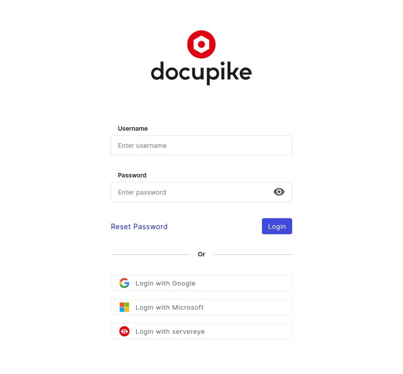

# servereye integration

The servereye Add-on is designed to synchronize data from servereye to docupike. The Add-on configuration will happen automatically during registration procedure.

## Overview

-   Automatic configuration during add-on registration
-   Synchronization occurs multiple times a day
-   Customer companies are synchronized as tenant
-   Users are synchronized as individuals
-   Users are assigned to tenant/s
-   Each user is assigned to the "servereye reader" group
-   The "servereye reader" group is only permitted to read data
-   Objects are synchronized for each tenant
-   Categories are synchronized for each Object

## Login

This gives you an oversight how-to login for the first time.<br>
Access your docupike.cloud instance using the following URL schema:

```
https://<your_subdomain>.docupike.cloud/
```

Navigate to the Web UI of docupike to view the login screen:

You can log in either through servereye or by using your username and password. This grants you access to the default tenant, which is not associated with any specific customer.

[](../img/screenshots/admin/servereye/login.png)

[helpdesk]: mailto:help@docupike.com

!!! info "No default login"
    docupike has no default login. Instead, during installation, the first individual user will be created automatically. This user has the admin role with all rights and permissions.

!!! info "Reset password"
    If you forget your password or need to change it, use the `Reset Password` button on the login screen.

After logging in, the servereye Add-on is already configured and does not need further setup. It also automatically performs synchronization of the servereye data.

## Rights in docupike

As an admin, you can view all tenants and configure docupike.

However, synchronized users only have the rights to view tenant assigned to them, **with permissions limited to reading all objects and categories**. You have the option to assign create, edit and additional [permissions](rights-and-permissions.md) as needed.

!!! note ""
    Do not directly change the permissions of the 'servereye reader group', otherwise there may be problems with synchronization.

## Tenants

A separate tenant is created for each customer. Access these tenants through the dropdown menu located at the top left, next to the docupike logo.

## User

Each user, which have at least access to one tenant, is synchronized from servereye. The [Users](users-groups-roles.md) can be found via `Settings > User management > Users`. Users are matched via E-Mail address.

## Objects and categories

Objects are unclassified initially and will be imported into the class **servereye import**. The classification needs to be done by the user.

Synchronized categories are **CPU**, **IP**, **Memory**, **Model**, **Storage Devices**, and **Storage Volumes**.
Entries in the listed categories undergo updates through the servereye sync. **Manual alterations to synchronized entries are overridden** by each synchronization procedure.

## servereye synchronization

You can check the servereye synchronization via `Add-ons > servereye settings`. Here you can see the synchronization logs and their status.

## Widget

docupike has a [Widget](../user/basics/widgets.md) view.

This widget allows to see date of the last synchronization and also allows jumping into the corresponding servereye asset.
