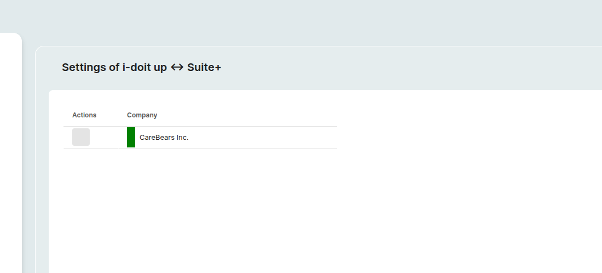
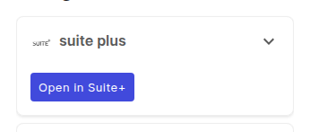

# Suite+ bridge

The **Suite+ bridge** keeps the objects in i-doit up and the assets in **Suite+**, the separate GRC product by i-doit GmbH, in step.
Once the bridge is connected for your tenant, objects you create in i-doit up appear as assets in Suite+ and assets you create in Suite+ appear as i-doit up objects, so the same items do not need to be maintained in two places.

This page describes the i-doit up side of the bridge, the *Suite+* settings surface, the per-object jump action, the single-sign-on behavior, and how data flows in both directions.

!!! info
    This page describes the i-doit up side of a bridge that is **already set up**.
    The initial installation of i-doit up as part of the Suite+ bundle runs through the [Suite+ guide to setting up i-doit up](https://suiteplus-wikijs.i-doit.com/de/integration/i-doit-up-einrichtung).

## What the bridge does

The bridge is a i-doit GmbH-operated middleware that connects one i-doit up tenant to one Suite+ workspace.
With an active bridge you get:

- **Asset / object sync** in both directions, kept in step by webhook-driven create / update / delete events.
- **Jump from an i-doit up object to its Suite+ asset** via the *Open in Suite+* widget on the object detail page.
- **Jump from a Suite+ asset to its i-doit up object** via an *Edit in i-doit up* action on the Suite+ asset detail page.
- **Embedded i-doit up documentation inside Suite+**: a selection of attributes is shown live on the Suite+ asset detail page.
- **Single sign-on** in both directions: a user logged in to Suite+ is automatically logged in to i-doit up on jump, and vice-versa.
    The user's i-doit up rights and permissions apply.

The exact catalogue of synced objects, plus the field-level mapping, is defined by the middleware and the Suite+ side; treat the bullets above as the user-visible contract.

## Where to find it

Open the [user menu](../user/basics/user-menu.md) (avatar at the top-right) → **Settings**.
At the bottom of the left sidebar, below *Administration*: sits the **Suite+** group with a single entry **Settings**.

Like every other settings surface, the page is scoped to the active tenant, see [Switch between tenants](../user/basics/tenant-switcher.md).

## Settings page layout

The page is a single table.

| Column | Notes |
|---|---|
| **Actions** | A **Sync** icon button per row. Not actionable in the current release: the icon is always rendered in the disabled state, see *Sync* below for the background. |
| **Company** | The tenant the row represents. A vertical color bar on the left shows the latest bridge state: **green** means *connected and the last sync succeeded*. |

A third, intentionally empty column is reserved for additional indicators.

## Sync

The current release does **not** expose a manual Sync trigger.
The Sync icon in the Actions column is always rendered in its disabled state (hovering shows a "not allowed" cursor), and the page contains no other element that starts a sync.

Day-to-day sync runs entirely on webhooks:

- every object **create**, **title change**, and **delete** in i-doit up is forwarded to Suite+,
- every asset created or deleted in Suite+ is forwarded to i-doit up,
- user and tenant create / update / delete events flow both ways (registered when the bridge add-on is installed).

So once the bridge is connected, you should not need a manual sync.
If your tenant ever drifts out of step, contact your i-doit GmbH representative.

## Per-object jump (Open in Suite+)

On every [object detail page](../user/basics/object-details.md), a widget on the right-side *Widgets* pane links the object to its Suite+ counterpart.

When the object has a matching Suite+ asset, the widget shows an **Open in Suite+** action that opens the asset in a new tab.

When no Suite+ asset is mapped yet (for example because the object was created before the bridge was connected, so its create webhook never fired), the widget shows the placeholder *Object is not available in Suite+* instead.

The widget sits at the top of the right *Widgets* pane on the object detail page, ahead of the default *Information* and *History* widgets:

The reverse direction (jumping from a Suite+ asset to the i-doit up object) is offered on the Suite+ side as an *Edit in i-doit up* button, see the [Suite+ documentation for the i-doit up bridge](https://suiteplus-wikijs.i-doit.com/de/integration/i-doit-up-bridge).

## What syncs in each direction

| Direction | What flows | Trigger |
|---|---|---|
| **i-doit up → Suite+** | Object create, title update, delete. | i-doit up webhooks. |
| **Suite+ → i-doit up** | Asset create with a known asset type → matching object in the corresponding class. | Suite+ asset events. |
| **Suite+ delete → i-doit up** | Asset deletion cascades into i-doit up: the matching object is removed and the pair is dropped from the asset-id map. | Suite+ webhook. |
| **Tenant lifecycle** | Tenant create / rename / delete on either side is mirrored on the other (delete deactivates the Suite+ tenant). | Tenant webhooks registered on add-on install. |

## Single sign-on

Once the bridge is active for a tenant, sessions are exchanged automatically:

- Opening i-doit up while logged in to Suite+ logs you in as the corresponding i-doit up user; your i-doit up rights and permissions apply.
- Opening a Suite+ asset from the [Open in Suite+](#per-object-jump-open-in-suite) widget logs you in to Suite+ as the corresponding user.

Mechanically, clicking *Open in Suite+* opens a new tab on the matching Suite+ workspace (the subdomain pattern is `<tenant>.suite.i-doit.coffee`) and hands it a short-lived federated JWT issued by the bridge middleware.
Suite+ exchanges the JWT for a session and redirects to the corresponding asset detail page.
You never see a second login screen during a successful jump.

If the i-doit up user does not yet exist on the Suite+ side, the jump cannot complete: Suite+ returns an authentication error instead of opening the asset.
The user-create webhook (registered when the bridge is installed) keeps Suite+ in step for new users, so this only affects users that already existed before the bridge was connected.

## Locale follows the user

When a Suite+ user views embedded i-doit up data on a Suite+ asset detail page, the i-doit up content is rendered in the user's Suite+ language.
The bridge passes the locale (for example `_locale=de` or `_locale=en`) on every data fetch, see [Profile](../user/basics/profile.md) for where the i-doit up language preference lives.

## When the Suite+ entry is hidden

The *Suite+* sidebar group is contributed by the bridge add-on and is only visible on tenants that have the bridge licensed.
If your tenant does not show the group, the URL above returns a *Page not found*: see [Empty states](../user/basics/empty-states.md).
To activate the bridge, contact your i-doit GmbH representative; the underlying connection (endpoint URL, credentials) is *not* configured from this page.

## Further readings

- [Add-ons](addons.md), the bridge ships as an add-on and is enabled per tenant from the *Add-ons* surface.
- [Tenants](tenants.md), each tenant has its own bridge.
- [Notifications](../user/basics/notifications.md), the toast catalog where bridge events surface.
- [Rights and permissions](rights-and-permissions.md), controls who can reach the Suite+ settings page.
- [Object details page](../user/basics/object-details.md), host of the *Open in Suite+* widget.
- [Suite+ guide to setting up i-doit up](https://suiteplus-wikijs.i-doit.com/de/integration/i-doit-up-einrichtung): installation of i-doit up as part of the Suite+ bundle.
- [Suite+ documentation for the i-doit up bridge](https://suiteplus-wikijs.i-doit.com/de/integration/i-doit-up-bridge), the Suite+ side of the same integration.
