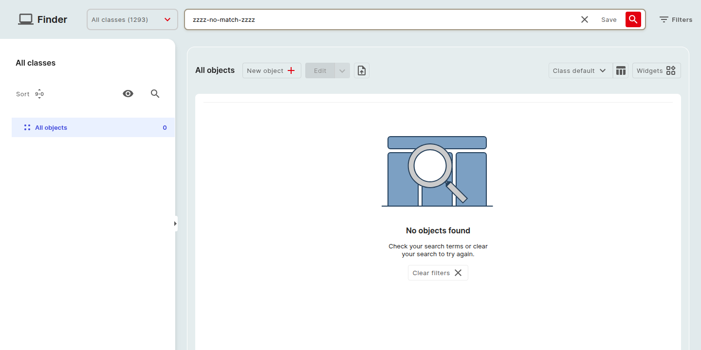

# Empty states

An **empty state** is the screen i-doit up shows when there is nothing to display, for example, a Finder table with no matching objects, or a 404 page.
Each empty state combines a heading, a short helper paragraph, an illustrative graphic, and (where appropriate) a call-to-action button that gets you out of the dead-end.

This page catalogs the empty states that appear during normal use.

## Catalog

### *No objects found*: Finder

Shown on `/finder` when the active class plus filter combination returns zero rows.

- **Heading:** *No objects found*
- **Body:** *Check your search terms or clear your search to try again.*
- **Action:** **Clear filters** removes every active [filter chip](../finder/set-filter.md); the class selection itself is left untouched.

The same empty state is reused on any class-scoped Finder table, including the [class list](../finder/class-list.md) and [Locations](locations.md).

### *Define network definition*: IP addresses tab

Shown on the **IP addresses** category of a Network object when the **Network definition** is missing.
See [IP address management](ipam.md) for the full attribute list.

- **Heading:** *Missing network definition*
- **Body:** *Please enter network definition first to be able to create IP addresses.*
- **Action:** **Add** opens the Network definition form pre-focused on the *Section* field.

The **Add +** and **Unassign** buttons above the table stay disabled until a network definition is saved.

### *No saved searches*: Edit dropdown

Shown inside the **Edit ⌄** dropdown above the Finder table when the active class has no [saved searches](../finder/saved-views.md) yet.

- **Heading:** *No saved searches yet*
- **Body:** *Configure a filter, then save it as a view to see it here.*
- **Action:** None, the prompt itself directs you to the **Set filter** dialog.

### *No reports*: Report Manager

Shown on `/report` when the tenant has no reports.
See [Report Manager](../reporting/report-manager.md).

- **Heading:** *No reports yet*
- **Body:** *Create your first report to combine attributes from multiple classes.*
- **Action:** **Add +** opens the report-creation modal.

### 404, *Page not found*

Shown when a deep-linked URL no longer resolves, for example, an object that has been deleted, or a malformed object ID.

- **Heading:** *Page not found*
- **Body:** *The page you were looking for does not exist or you do not have access to it.*
- **Action:** **Back to Finder** returns you to `/finder`.

### *Access denied*

Shown when you reach a surface that your role or permissions do not cover, for example, a settings sub-page that requires *Manage Subscription*.
See [Rights and permissions](../../admin/rights-and-permissions.md).

- **Heading:** *You do not have access to this page*
- **Body:** *Ask your administrator to grant you the right or permission required for this surface.*
- **Action:** **Back to Finder**.

## Conventions

- The illustration sits above the heading.
- The action button uses the same primary-button style as elsewhere in the app.
- Body copy is one short sentence, never a paragraph.
- An empty state never replaces global chrome (top bar, sidebar), it only fills the content area.

## Further readings

- [Finder overview](../finder/finder.md)
- [IP address management](ipam.md)
- [Report Manager](../reporting/report-manager.md)
- [Notifications](notifications.md), for transient feedback that disappears on its own.
