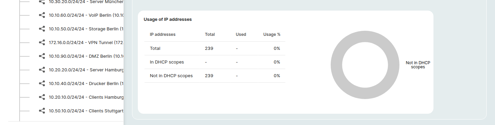

# IP address management

A **Network** object documents an IP network, its address range, default router, DHCP scopes, and the IP addresses assigned inside it.
The **IP addresses** category on a Network object lists every address in the network and lets you assign or unassign them.

For the per-object category that records *one* address on a server or other device, see [IP networking](ip-networking.md).

## All networks overview

Open **Inventory > Networks** at the top of the page to see a tenant-wide overview of every network and its IP usage.

The page has two parts:

### Networks table

A table of every Network object with the columns:

| Column | Notes |
|---|---|
| **Actions** | Per-row actions including opening the network detail page. |
| **Network definition** | Name and address range of the network. Click the column header to sort. |
| **Description** | Free-text description. |
| **Address range** | Start to end of the network. |
| **Usage total** | Number of addresses currently used inside the network. |
| **Usage %** | Used addresses as a percentage of the total range. |

Use **New network +** above the table to create a network or **Edit ⌄** for bulk actions on selected rows.
The left sidebar mirrors the table as a hierarchical **All networks** tree, clicking a parent network drills down into its subnets.

### IP addresses usage details

Below the table, the collapsible **IP addresses usage details** section breaks the same usage numbers down by address version into two side-by-side panels:

- **Usage of IPv4 addresses**
- **Usage of IPv6 addresses**

Each panel shows three rows, **Total**, **In DHCP scopes**, **Not in DHCP scopes**: with **Total**, **Used**, and **Usage %** columns.
Use the **Hide ⌄** / **Show ⌄** toggle to collapse or expand the section.

## Network detail page

Click a network in the *All networks* sidebar tree (or the row arrow in the table) to open its detail page.

The page header shows the network name, the class label, and the address range (for example *Network (10.10.10.0 - 10.10.10.255)*), plus a small **open-in-new** icon that links to the object's full categorized detail page.

Three tabs sit below the header:

- **IP addresses**: the same table described in *Open the IP addresses table* above.
  After a Network definition is saved, the table is pre-populated with reserved entries (the network address itself, the default router, and broadcast) plus any addresses you assign.
  Each row has a pencil **Edit** action; the **Configuration** column shows a colored indicator (for example a black bar for *Network address*) plus a status text.
- **DHCP scopes**: DHCP-managed ranges defined for this network.
- **Networks**: the network's subnets.

### Networks tab (subnets)

The **Networks** tab on a network detail page lists every Network object whose address range falls inside the parent.
A subnet is a regular Network object, it has its own *Network definition*, IP addresses table, and donut chart.

The tab shows the same columns as the all-networks table:

| Column | Notes |
|---|---|
| **Actions** | Per-row actions including opening the subnet's detail page. |
| **Network definition** | Name and address range of the subnet. |
| **Address range** | Start to end of the subnet. |
| **Usage total** | Number of addresses currently used inside the subnet. |
| **Usage %** | Used addresses as a percentage of the subnet's range. |

A **New network +** button above the table creates a child network, the parent's address range is pre-filled in the new network definition so you only need to narrow it.

The same hierarchy appears in the left **All networks** sidebar tree on the all-networks overview: clicking a parent network expands its subnets; clicking a leaf opens its detail page.

### Usage details (with donut chart)

A **Usage details** section sits below the table on the *IP addresses* tab and is the one place in IPAM that shows a graphical visualization:

- A **Usage of IP addresses** table with the rows **Total**, **In DHCP scopes**, **Not in DHCP scopes** and the columns **IP addresses** / **Total** / **Used** / **Usage %**.
- A **donut chart** on the right that visualizes the same breakdown.
  The chart's legend matches the table rows; segments fill in as addresses get assigned, so an empty network shows the chart in a single neutral color while a populated network shows distinct slices for each row.
- A **Hide ⌄** / **Show ⌄** toggle on the section header collapses or expands the whole panel.

## Rights

You can manage IP addresses on any Network object you have write access to.
See [Rights and permissions](../../admin/rights-and-permissions.md).

## Open the IP addresses table

1. Open a Network object, for example by selecting the **Network** class from the *All classes* dropdown above the Finder table and clicking an entry.
2. In the object's category sidebar (under **All categories**), choose **IP addresses**.

## Network definition is a prerequisite

Before any IP addresses can exist on a Network object, the network itself must be described.
If the **Network definition** category is empty, the IP addresses table shows the prompt:

> *Missing network definition, Please enter network definition first to be able to create IP addresses.*

The **Add +** and **Unassign** buttons stay disabled until a network definition is saved.
Click **Add** in the prompt (or open the **Network definition** category in the sidebar) to fill in:

- **Section**: the address class or zone the network belongs to.
- **Version**: IPv4 or IPv6.
- **Network address**: the base address of the network.
- **Subnetmask**: the CIDR of the network.
- **Default router**: the IP reserved as the default gateway.

After the definition is saved, the IP addresses table activates.

## What the table shows

Once Network definition is in place the table has the following columns:

| Column | Notes |
|---|---|
| (checkbox) | Selects rows for the **Unassign** action. |
| **Actions** | Per-row actions. |
| **IP address** | The address. Click the column header to sort. |
| **Configuration** | How the address is configured (for example *Static*). |
| **Objects** | The object or objects the address is assigned to. |

The table is paginated at the bottom, with a page-size selector to switch how many entries are shown.

Two filter controls live above the right edge of the table:

- **All IP addresses ⌄**: filter the table view (for example to show only assigned, unassigned, or grouped empty ranges).
- **Expand ranges ↕**: toggle whether unassigned ranges are shown as one row per range or expanded into individual addresses.

## Assign an IP address

1. Hover the row of an unassigned address (or an unassigned range).
2. Click **Edit** in the row's **Actions** cell.
3. In the **Edit IP address** modal, fill in the **Object** the address belongs to and the **Configuration** (for example *Static assigned*).
4. Click **Save**.

## Unassign one or more addresses

1. Select the addresses to unassign using their checkboxes.
2. Click **Unassign** above the table.
3. Confirm in the dialog.

The button is disabled until at least one row is selected.
Already unassigned rows in your selection are ignored.

## Related categories on a Network object

In addition to **IP addresses** and **Network definition**, a Network object exposes:

- **DHCP scopes**: DHCP-managed address ranges.
- **Subnets**: child networks contained within this network.

## Further readings

- [IP networking](ip-networking.md), the per-object category that stores an individual address on a server or other device.
- [Objects](objects.md)
- [Categories and attributes](categories-and-attributes.md)
