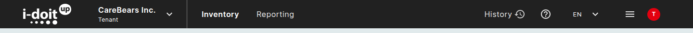

# Top bar reference

The fixed bar at the top of every page exposes navigation, status, and user-account actions.
This page lists each control from left to right.

## Logo

The **i-doit up** logo at the far left always returns you to the default Finder.

## Tenant switcher

To the right of the logo sits the [tenant switcher](tenant-switcher.md).
It shows the active tenant name (for example **CareBears Inc.**) with the label *Tenant*.
Click it to change tenant if you have access to more than one.

## Inventory

Top-level dropdown with four entries:

| Entry | Description |
|---|---|
| **Finder** | The default object/class browser, see [Finder](../finder/finder.md). |
| **Locations** | The same shell scoped to a location tree, see [Locations](locations.md). |
| **Networks** | The IPAM overview, see [IP address management](ipam.md). |
| **Data Protection** | Add-on for GDPR documentation. Available with the *Data protection* add-on. |

## Reporting

Top-level dropdown with two entries:

| Entry | Description |
|---|---|
| **Report Manager** | Saved reports, see [Report Manager](../reporting/report-manager.md). |
| **Documents Creator** | Add-on for generating PDF/Word documents from CMDB data. Available with the *Documents Creator* add-on. |

## Upgrade

The purple **Upgrade** button opens **Settings ▸ Subscription** so you can review or change your plan, see [Subscription](../../admin/subscription.md).
The button is shown to every user; the page itself respects rights.

## History

The clock icon labelled **History** opens a popup with the most recent changes you (or any tenant member) made.

Each entry shows the action (*Set data*, *Created*, *Deleted*), the affected object's name, the user, and the timestamp.
A **Show complete History** link at the bottom of the popup navigates to the global history view for the active tenant.

The same widget is also available per-object on the [object details page](object-details.md), see [Object Tools](object-tools.md).

## Help

The **?** icon opens a popup with two entries:

- **Explore guide**: re-runs the Quick tour relevant to the current page (Finder Quick tour, Object detail Quick tour, Report Manager Quick tour).
- **Documentation**: opens the public documentation portal in a new tab.

## Language

The **EN** dropdown switches the UI language.
The current build offers:

- **English, EN**
- **Deutsch, DE**

The picker remembers the choice for the current session; the persistent default is set on your [profile](profile.md).

## View Mode Menu

The hamburger icon (≡) is labelled **View Mode Menu**.
It toggles the row density used in object tables across the whole application:

- **Compact**: denser, more rows on screen.
- ✓ **Comfortable**: default, more breathing room per row.

A check mark (✓) shows the active mode.

## User menu (avatar)

The avatar circle (your initial on a coloured background) opens the **user menu**: see [User menu](user-menu.md).

## Further readings

- [Tenant switcher](tenant-switcher.md)
- [User menu](user-menu.md)
- [Notifications](notifications.md)
- [Subscription](../../admin/subscription.md)
