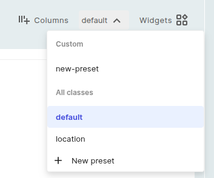

# Views and presets

{:target="_blank"}

The `Finder` shows your documentation in the form of customized tables. These tables offer different views on the documented data. The current view on the data can be adjusted by adding, removing or re-arranging [attribute](../basics/categories-and-attributes.md) columns.

Once you are happy with your set of columns, you can save it as a `View preset`. `View presets` have either a class or a global context.

## Class context

A class context means that the user can have a specific `View preset` for a certain [object class](../basics/classes.md), e.g. a `View preset` for servers shows IP addresses and hard drives while a `View preset` for persons shows full names and e-mail addresses.

## Global context

If a `View preset` has a global context it can be used for all object classes or if you look at objects from different object classes. This is useful for showing [search results](search-filters-and-reports.md).

## Classes or locations

In the navigation bar at the top you can switch between the `Finder` and the `Locations` view. This switch completely changes the way you are navigating through your information.
For both views, you can use a pagination at the bottom. Here, you are able to define the results per page and select the desired page.
