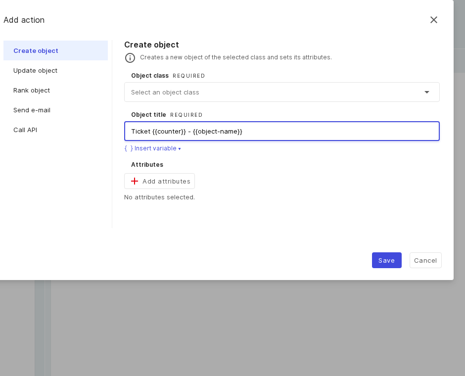
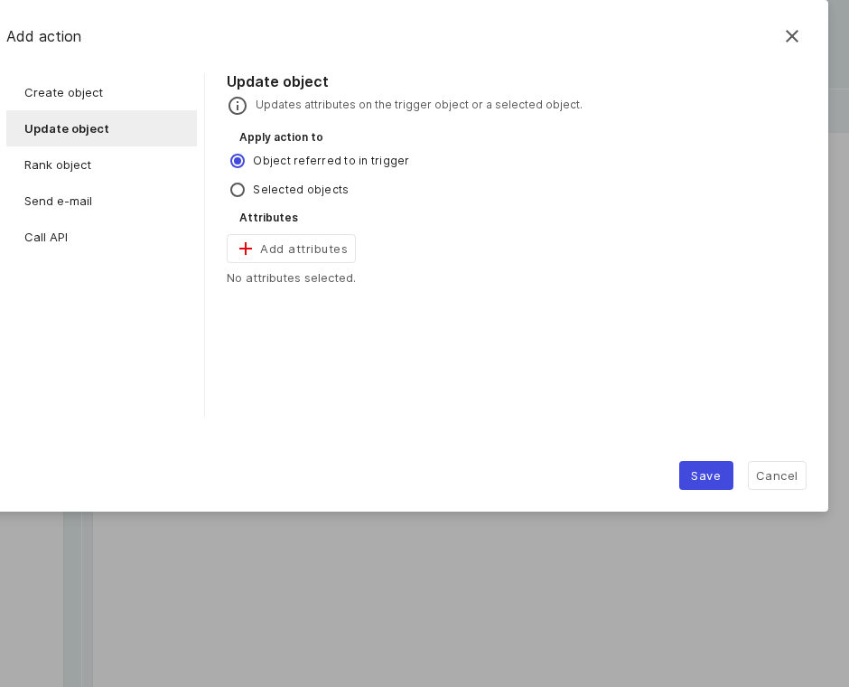
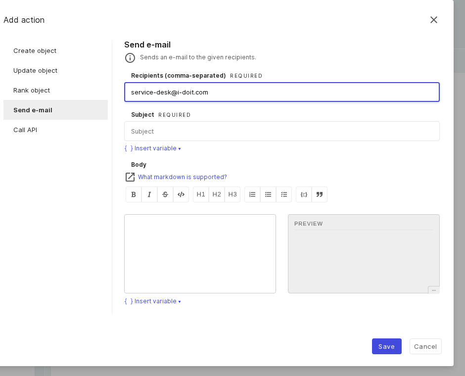
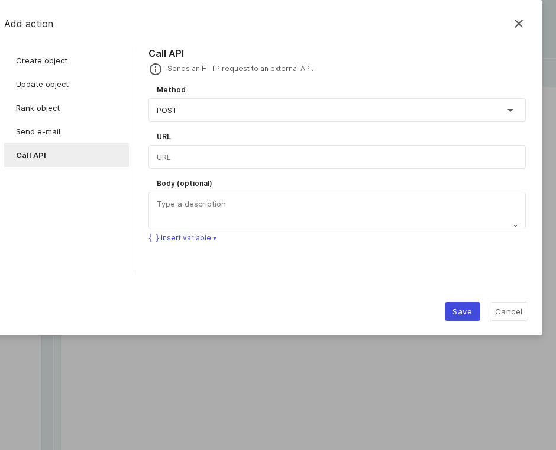

# Action use cases

An action can create, update, or rank an object, send an e-mail, or call an external API. Several actions run
in order. See [Triggers, conditions, and actions](reference.md) for the full reference.

## Create object: a notebook with a meaningful name

**Scenario:** the button flow creates a notebook whose title contains a counter and the trigger object.

- Choose the **Create object** action and pick the **Object class** from the searchable list (each option
  shows its type icon).
- Set the **Object title** with placeholders, for example `Notebook {{counter}} for {{object-name}}`.
- Use **Add attributes** to set fields (the attribute picker groups them by category).

**Create object:** object class, a title with placeholders, and the attribute selection.

## Update object: stamp a review date

**Scenario:** on a category change, a "last reviewed" date should be set.

- Choose the **Update object** action. Under **Apply action to**, pick **Object referred to in trigger**
  (default) or **Selected objects**.
- Select attributes through the picker; for date fields, tick **Use date of execution**. A multi-value
  category gains a new entry per run.

**Update object:** the target (trigger object or selected objects) and its attributes.

## Rank object: archive a retired device

**Scenario:** a button sets a retired device to the "archived" lifecycle state.

- Choose the **Rank object** action and pick the target (trigger object or selected objects).
- Set **Set state to** — normal, archived, or deleted.

**Rank object:** the lifecycle state (normal, archived, or deleted).

## Send e-mail: notify the service desk

**Scenario:** a time-based flow sends a formatted reminder.

- Choose the **Send e-mail** action and set **Recipients** (comma-separated) and a **Subject** (both
  required).
- Write the **Body** in the Markdown editor — input on the left, live preview on the right. Subject and body
  accept placeholders.

**Send e-mail:** recipients, subject, and a Markdown editor with preview.

!!! note
    SMTP delivery is configured server-side (`SMTP_URL` and `MAIL_FROM`); there is no per-instance setting.

## Call API: inform an external system through a webhook

**Scenario:** a newly created object is reported to another system with an HTTP POST.

- Choose the **Call API** action and set the **Method** (GET, POST, PUT, PATCH, DELETE) and the **URL**.
- Fill the **Body** with placeholders, for example `{"new":"{{object-name}}","id":"{{object-id}}"}`. Outbound
  calls can be routed through a proxy.

**Call API:** the method, URL, and an optional body with placeholders.

## Further readings

- [Trigger use cases](triggers.md)
- [End-to-end example](end-to-end.md)
