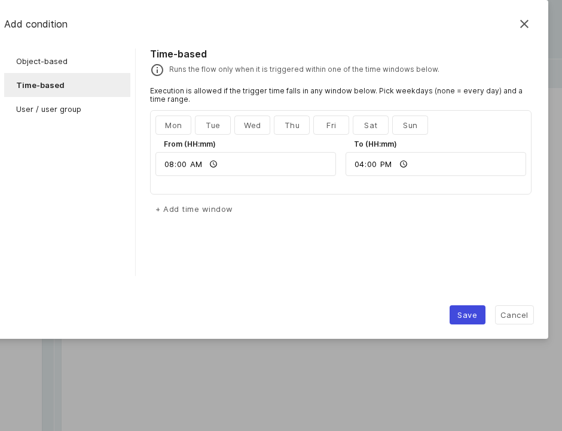
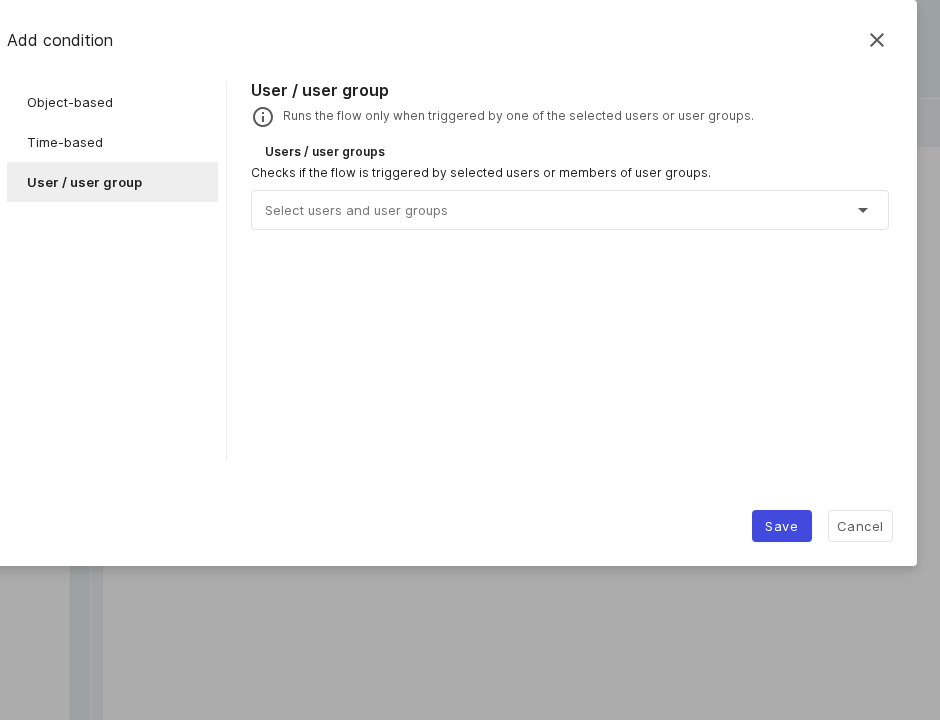

# Condition use cases

Conditions are optional and must _all_ be met. When one is not met, the run is recorded as _Skipped_ with a
reason in the Logs. See [Triggers, conditions, and actions](reference.md) for the full reference.

## Object-based: only for objects in operation

**Scenario:** a flow should run only when the trigger object has a specific CMDB status or attribute value.

- Choose the **Object-based** condition.
- Build a rule in the filter builder with **Add filter** and **Select operation** (for example, "CMDB status
  is in operation"); several filters are joined with _And_.

**Object-based condition:** a visual filter builder with _And_ logic and operations.

## Time-based: only during business hours

**Scenario:** the flow should run only Monday to Friday between 08:00 and 16:00.

- Choose the **Time-based** condition.
- Select the weekdays (no selection means every day) and set the **From** and **To** times.
- Add more windows with **Add time window**.

**Time-based condition:** weekdays plus a from/to time window.

## User / user group: allow only certain people to trigger

**Scenario:** the flow should run only when a member of the "IT team" group triggers it.

- Choose the **User / user group** condition.
- Select users and user groups from the list (group membership is resolved automatically).

**User / user group condition:** restrict who may trigger the flow.

!!! note
    For button flows, the button is hidden for people who can never meet the person condition. For
    object-based and time-based conditions, the button stays visible but inactive, with a tooltip that
    explains why.

## Further readings

- [Trigger use cases](triggers.md)
- [Action use cases](actions.md)
