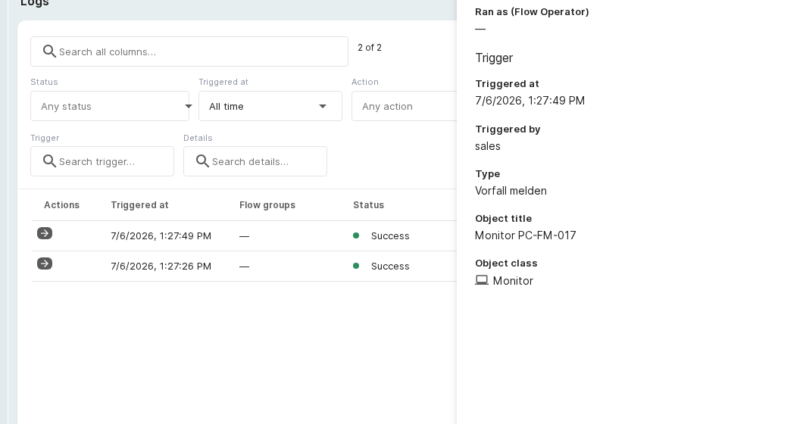

# End-to-end example

This chapter walks through a complete flow, from creation to a logged execution.

**Scenario:** a **Report incident** button appears on every object view. A click reports the incident to an
external ticket system through a webhook (HTTP POST) and passes the object name, object ID, the reporting
person, and a running ticket number.

## Step 1: create the flow

In the overview, select **Add flow**, enter the name "Report incident to ticket system", and add a
description.

## Step 2: configure the trigger

Choose the **Button** trigger with **Button name** "Report incident", the button group "Service desk", and
placement **Any object** (the button appears on every object).

## Step 3: configure the action

Choose the **Call API** action, method **POST**, the ticket-system URL, and a body with placeholders:

```json
{ "object": "{{object-name}}", "id": "{{object-id}}", "reported_by": "{{users-name}}", "ticket": "#{{counter}}" }
```

## Step 4: save and activate

The finished flow shows the linear chain **Trigger → Conditions → Action → End**. Select **Activate** to make
it live (status _Active_).

[](../../img/screenshots/flows/end-to-end-flow.png)
**Activated flow:** the end-to-end flow with a button trigger and a Call API action.

## Step 5: trigger and check the result

A click on the **Report incident** button on an object starts the flow. Under **Logs**, the run appears with
status _Success_; the detail panel shows the time, the triggering person, the trigger object, and the action
that ran.

[](../../img/screenshots/flows/end-to-end-logs.png)
**Logged run:** a successful button-triggered Call API run, recorded with its trigger object and the
triggering user.

## Activation, test mode, and logs

A saved flow starts as _Inactive_. In the detail view, **Activate** makes it live and **Switch to test mode**
runs it in a neutral state where actions are only simulated. Every run is recorded under **Logs** with its
time, status (success, skipped, or error), and reason.

!!! note
    Actions that change the CMDB (create, update, or rank an object) run as the _flow user_. For them to
    take effect, that user needs the required object rights once (opt in under **Flow users**). Webhook and
    e-mail actions like the one above need no CMDB write rights.

## Further readings

- [Flows overview](index.md)
- [Action use cases](actions.md)
