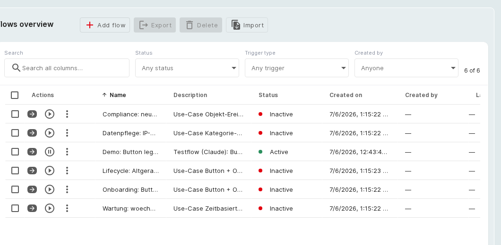

# Flows

Flows is an add-on that automates repetitive tasks in i-doit up. Every flow is a strictly linear chain:

**Trigger → Conditions (optional) → Action(s)**

- **Trigger** — what starts the flow (exactly one, required).
- **Conditions** — extra requirements that must _all_ be met, otherwise the run is skipped (optional).
- **Actions** — what the flow does (at least one; multiple actions run top to bottom).

The add-on interface follows the interface language of i-doit up (English or German) and appears under
**Add-ons** in the top navigation.

## Overview and interface

Open the add-on from **Add-ons > Flows**. The start page is the overview with a search-and-filter bar
(status, trigger type, creator), per-row actions (open, test, menu), and the **Add flow**, **Export**, and
**Import** buttons. The left sidebar switches between **All flows**, **Logs**, and **History**.

**Flows overview:** every flow with its status, trigger type, and per-row actions.

## Create a flow

Select **Add flow** to open the editor. A **Name** is required; a **Description** and **Flow groups** are
optional. Build the body with **Add trigger**, **Add condition**, and **Add action** — each opens a dialog
with a type list on the left and the form on the right.

You can save an unfinished flow as a draft (status _Inactive_); required fields are checked on save. If you
hold the **Select Flow Operator** right, you can also choose which flow user the flow runs as.

## Access and rights

Access is governed by the standard i-doit up rights system under **User management > Rights > Add-on rights >
Flows**. The add-on contributes two rights:

- **Manage Flows** — full access to the add-on. Without it, the **Flows** entry is hidden and the add-on API answers with a permission error. The admin role receives this right automatically on installation.
- **Select Flow Operator** — lets a user choose which flow user a flow runs as, and opens the **Flow users** settings page.

The **Manage Flows** right governs access to the interface only. Whether an active flow runs depends solely
on its trigger, regardless of who triggers it.

## Further readings

- [Triggers, conditions, and actions](reference.md)
- [Trigger use cases](triggers.md)
- [Condition use cases](conditions.md)
- [Action use cases](actions.md)
- [End-to-end example](end-to-end.md)
- [Add-ons](../../admin/addons.md)
