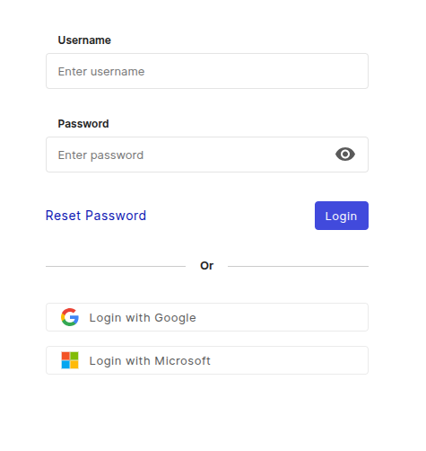

# First login

This gives you an oversight how-to login for the first time. You can access your i-doit up instance with the following URL schema:

~~~
https://<your_subdomain>.docupike.cloud/
~~~

Your subdomain is initially requested by your administrator when ordering a i-doit up instance and usually matches your organization's name. If you don't know your organization's subdomain contact your administrator or the [i-doit up support][helpdesk].

Point your Web browser to the Web UI of i-doit up to see the login screen:

[helpdesk]: mailto:help@docupike.com

!!! info "Login with"
    Login with Google or Microsoft is available when your E-Mail address is linked to a user

!!! info "No default login"
    i-doit up has no default login data. Instead, during the installation the first individual user will be created automatically. You will receive a E-Mail with a link to create a password. This user has the admin role with all rights and permissions.

!!! info "Reset password"
    If you forgot your password or simply need to change it, you can use the `Reset Password` button on the login screen.
