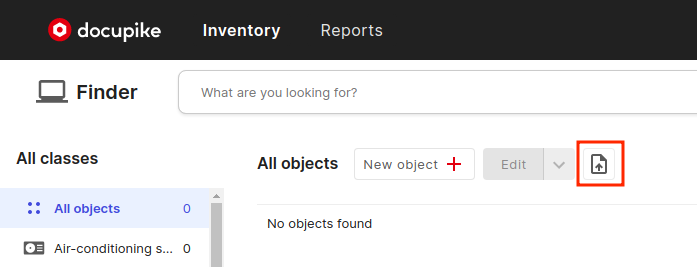
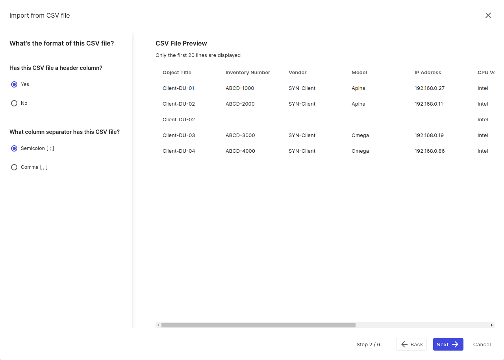
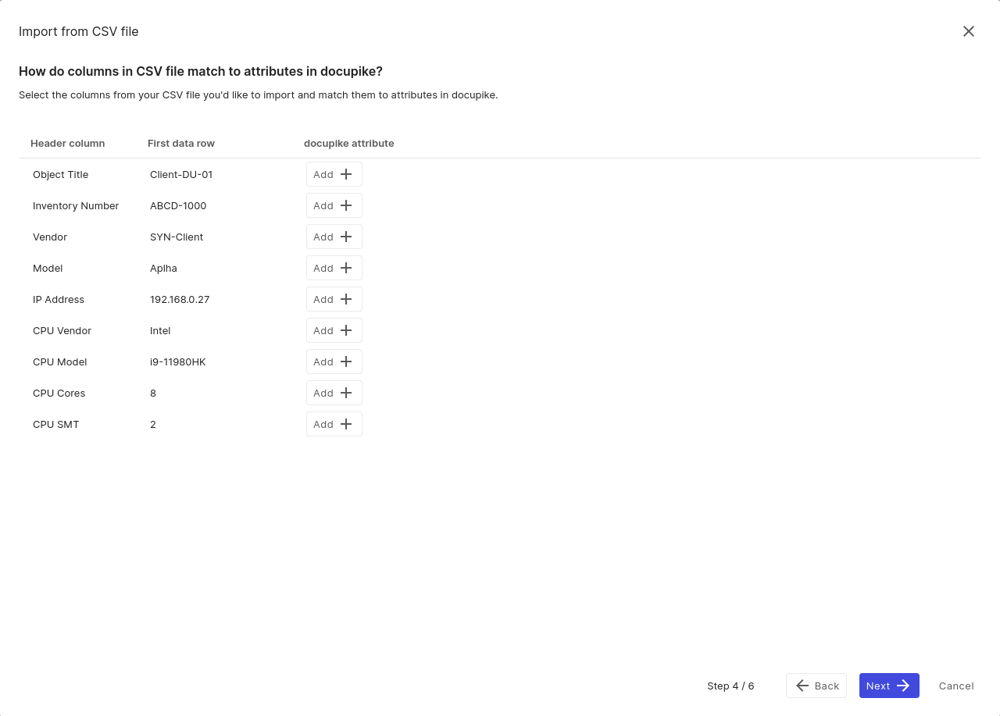
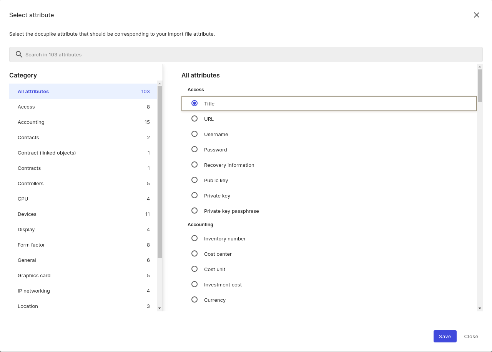
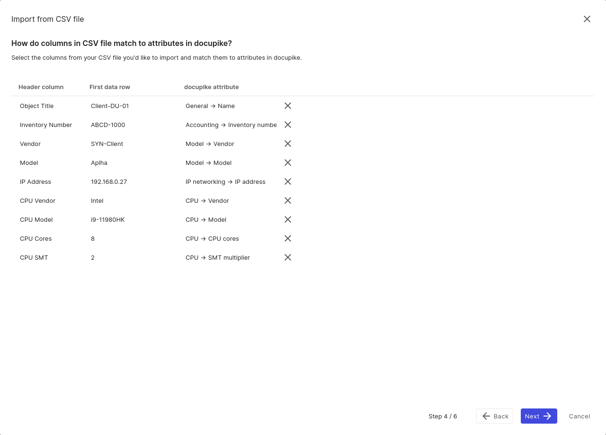
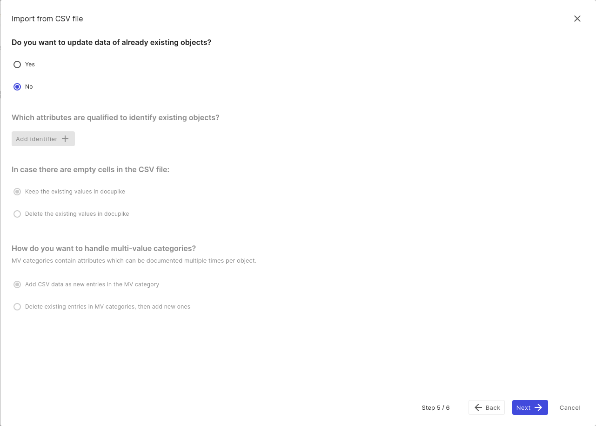
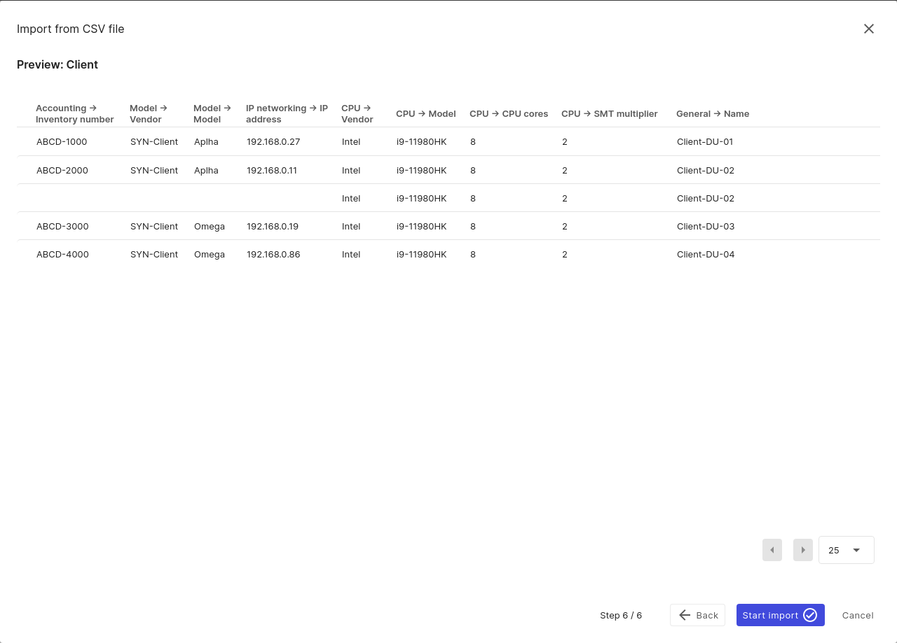

# How do I get existing data imported

The way to import existing Data into docupike is to use the CSV Import. Before you start, you should know what information you want to import and whether the attribute can be documented in a category.

## Requirements

- A CSV file must not be greater than 128MB in size.
- A CSV file should contain less than 250 rows.
- One object Class per CSV File.
- The right to Import.

## Upload CSV file

In the object view, you will see the `Import from CSV file` icon in the header menu.

Here we are able to select and upload a valid CSV file. After a successful upload we can continue.

## CSV format

The second step allows to define if a column header exists in your CSV file. Furthermore, we can specify if our CSV file uses `Semicolon` [;] or `Comma` [,] as separator.
A small preview allows you to review your settings.

## Class selection

At the third step we declare the `object class`. Only one class can be selected for each import.

## Attribute mapping

During this step each column gets its own row in the mapping. Thus, each row of the CSV file can be linked to an attribute.

After clicking on the `Add` button, the appropriate attribute can selected from the extended dialog menu or its name can be entered directly into the search bar to have suitable attributes suggested.

Now you pick the corresponding attribute via the `radio button` and click save to confirm the selection. This way, each column is assigned until all assignments are complete. Assignments can be solved later. Columns without assignment will be ignored during the import.

## Update existing data

Here you can optionally choose if you want to `update` existing objects or only `create new objects`.
We choose `No`.

## Preview

The last step displays a `preview` of the import mapping. If everything is in order you can `Start import`. Otherwise you can go back and change the necessary settings.

