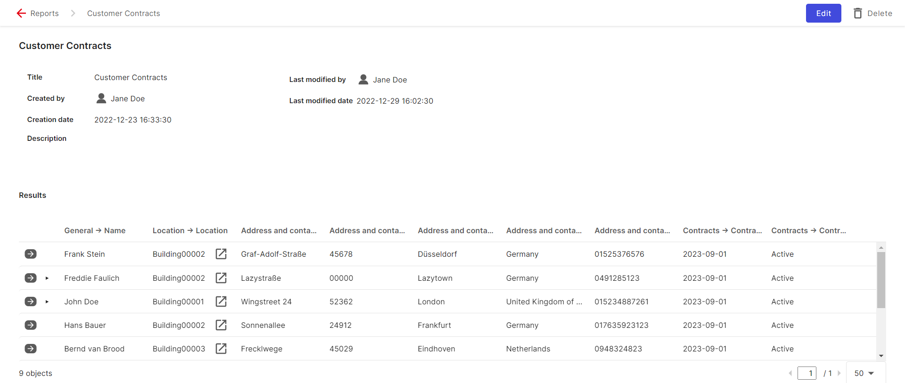
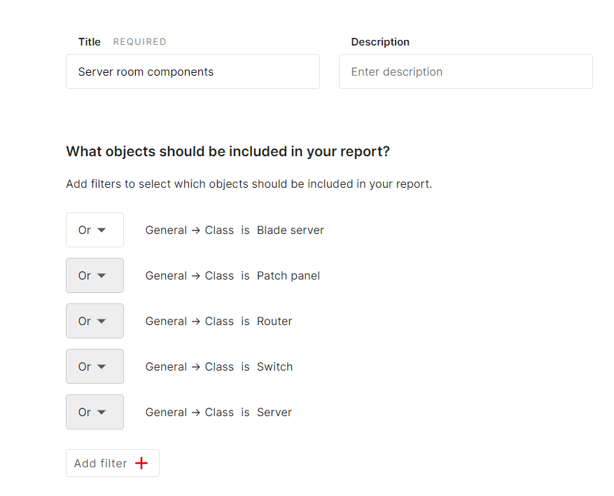
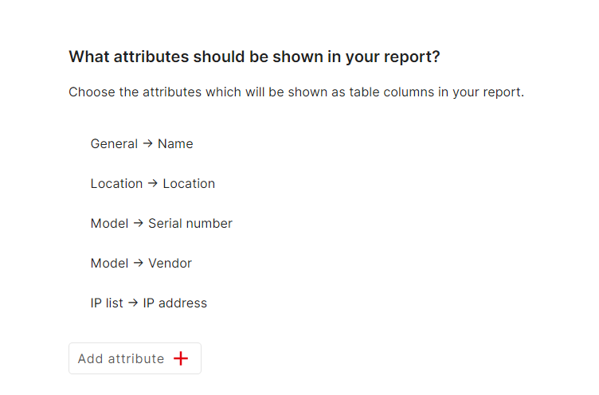

# Reports

You can create many useful reports using the report function. To do this, first click on the "Reporting" button in the menu bar and select "Report Manager". You can create a report by clicking on "Add" as an example, we will create a report for all customers with an active contract that ends before 2024. First, we add a report and enter a title. Next, we specify which objects should be included in the report. To do this, we add `AND` or `OR` connections. In this example, we will use `AND` conditions.

We want all objects with the "Customer" class that have the contract status "active" and the contract end date "before 2024."

Therefore, we will add the following three conditions:

{:target="_blank"}

If you check the preview below, you will see that only the names of the customers are displayed. To see more, you can add the required attributes of the customer.

{:target="_blank"}

Now let's save the report and open it in the report view.

{:target="_blank"}

Another example of a report could be displaying server room components such as servers, switches, etc. To do this, we need to add "OR" connections for the classes.

{:target="_blank"}

Next, we add the attributes we want to see from the objects.

{:target="_blank"}

Now we can view the report in the report view after saving it.
