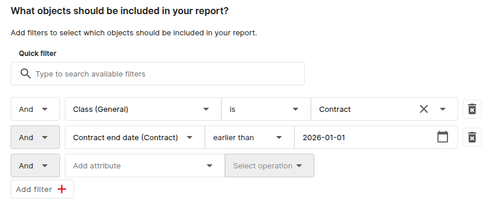
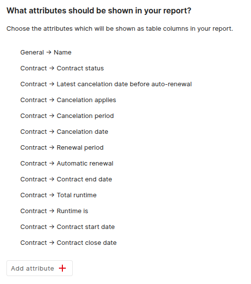
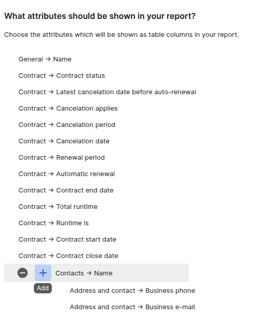
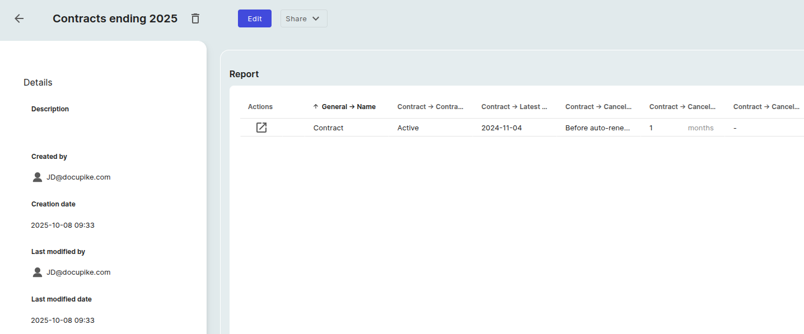

# Report Manager

You can create many useful reports using the report function. To do this, first click on the "Reporting" button in the menu bar and select "Report Manager". You can create a report by clicking on "Add" as an example, we will create a report of contracts that ends in 2025. First, we create a report and enter a title like `Contracts ending 2025`. Next, we specify which objects should be filtered by the report. To do this, we add `AND` or `OR` connections. In this example, we will use `AND` conditions.

We want all objects with the "Contract" class that have ends in 2025. Therefore, we will add the following two conditions:

{:target="_blank"}

If you check the preview below, you will see that only the names of the contracts are displayed. To see more, you can add the required attributes of the contract.

{:target="_blank"}

Additionally, you can also add information from related objects. For example, if you want to see the contract partner of the contract, you can add the attribute `Contact → Name`. After that you can add attributes from the related object `Contact`.

{:target="_blank"}

If you are satisfied with the result, save the report and open it in the report view.

{:target="_blank"}
