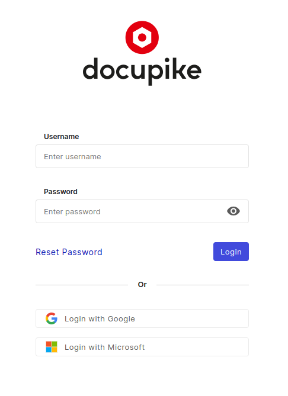

# First login

This gives you an oversight how-to login for the first time.

You can access your i-doit.cloud instance with the following URL schema:

~~~
https://<your_subdomain>.i-doit.cloud/
~~~

Your subdomain is initially requested by your administrator when ordering i-doit.cloud and is assigned at the time of installation and usually matches your organization's name. If you don't know your organization's subdomain contact your administrator or the [i-doit.cloud support][helpdesk].

Point your Web browser to the Web UI of i-doit to see the login screen:

[helpdesk]: mailto:help@i-doit.cloud

!!! info "No default login"
    i-doit has no default login like an admin user called `admin` with a trivial password like `admin`. Instead, during the installation the first individual user will be created automatically. This user has the admin role with all rights and permissions.

!!! info "Reset password"
    If you forgot your password or simply need to change it, you can contact our support. If wrong credentials are used for login, you will also be shown a link to contact our support, who will be pleased to help you.
