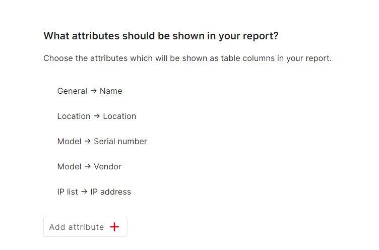

# Reports

You can generate a lot of useful reports with the reports function. You can start by clicking the Reports button on the menu bar.
You create a report by clicking "Add Report".

As an example we are going to create a report for all customers with an active contract that ends before 2024.
The first thing we are going to do, is add a report and enter a Title.
Next we are going to define, what objects should be included in the report.
We do that by adding "AND" or "OR" connections.
For this example we are using AND connections.
We want all objects with the class "customer", that have the contract status "active" and the contract end date "earlier than 2024".
So we are going to add those 3 conditions as seen below:

Checking the preview at the bottom, you can see only the name of the customers is being displayed.
To see more than that, you can add the required attributes of the customer.

Now we save the report and open it from the report view.

Another example of a report could be the display of server room components like servers, switches, etc.
To do that, we need to add "OR" connections for the classes.

Next we add the attributes that we want to see from the objects.

Now we can display the report from the report view after saving.

