In this use case, we show you how to configure permissions for different user groups. Access to information usually needs to be controlled precisely. With Docupike, you can configure access to information for users, groups and even roles.

In this use case, we will show you how to configure access to 3 different groups.

**Case 1:**

Our **accounting department** should have access to all assets, but only be able to see accounting data and the location of the devices. Editing by the accounting department should also only be possible in this category.

**Case 2:**

In the second group, **external service providers** are to be given access to the information of a specific location. Access is not allowed to the data in other locations.

**Case 3:**

In group 3, the **application**  **admins** should only be able to edit objects of the class "Server". All other objects should neither be readable nor editable.

# Case 1: Determine access to data

Permissions can be assigned for individual users, for defined roles and groups. Combinations of roles and groups are also possible. Both roles and groups are containers to which users can be added and for which **different permissions** can be assigned.

We will now create a new group and person who will have read access to all objects, but will only see and be able to edit entries in the Accounting category.

We switch to the Settings and create a new group named **"Accounting"** under User management -\> User groups. Here we will later add all users who work in accounting.

Now we create a **new user** under User management -\> Users.

[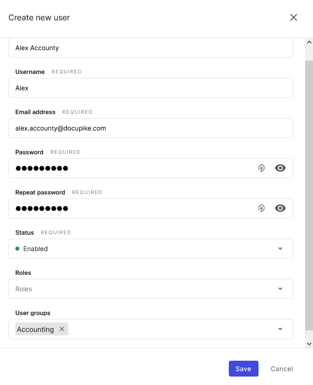](../../img/screenshots/rights-assignment/create-new-user.png)

Now we configure the permissions under User management -\> Permissions

Our group **"Accounting"** should be able to read, create and modify accounting data. Additionally, it should be able to determine the location of assets. All other information should not be visible for this group.

The first step is to define the basic access to assets. For this purpose, we create a new permission.

Here we grant read access to all objects in the "General" category. This is necessary so that basic asset information such as the name is visible.

[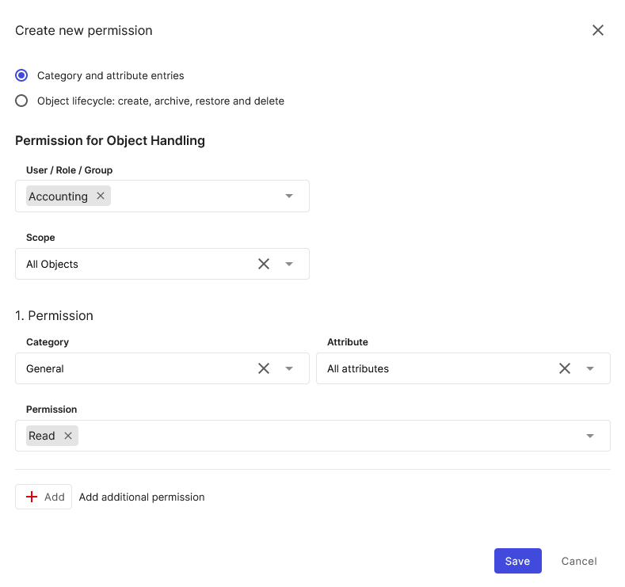](../../img/screenshots/rights-assignment/create-new-permission-accounting.png)

We create a new permission that applies to "Category and attribute entries".

We select "Accounting" as the user group and specify "All Objects" as the scope.

# Configure access to accounting

Now we grant for the category accounting on all attributes permissions for create, read and edit. Existing data should not be deleted.

[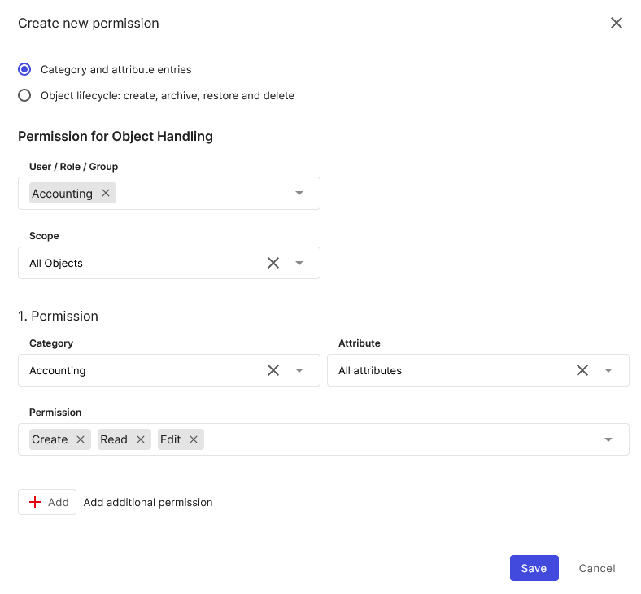](../../img/screenshots/rights-assignment/create-new-permission-accounting-2.png)

# Configure access to location

Finally, we would also like to grant read permission for the location of devices. This is not insignificant, as accounting staff also need to check where devices are located.

[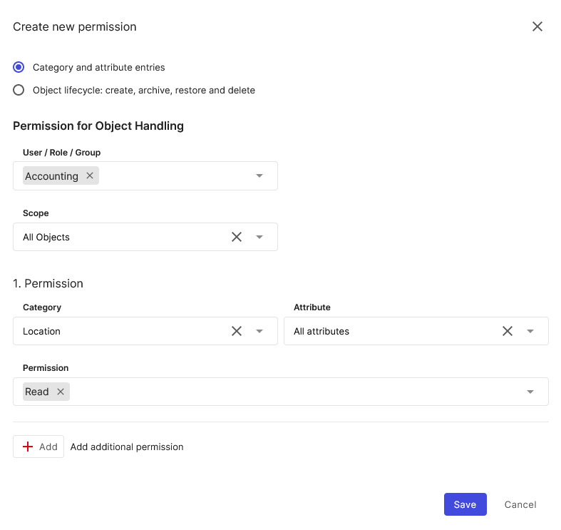](../../img/screenshots/rights-assignment/create-new-permission-location.png)

With this we are done with the configuration for the user group "Accounting" and can now test the permissions.

[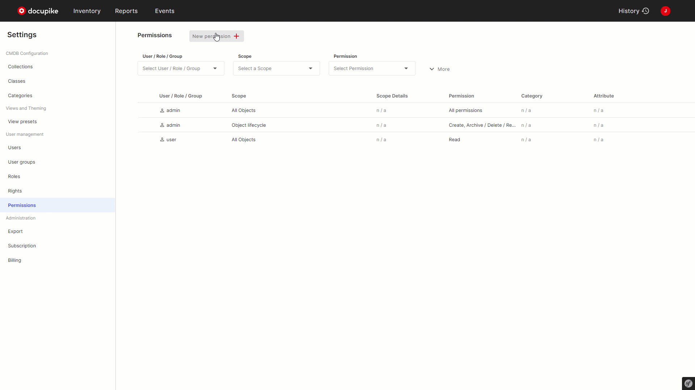](../../img/screenshots/rights-assignment/permissions-config-accounting.gif)

# Test permissions

The easiest way to test the permissions is to create a new user, add it to the respective user group and log in with it.

We log in with our created user "Alex Accounting".

[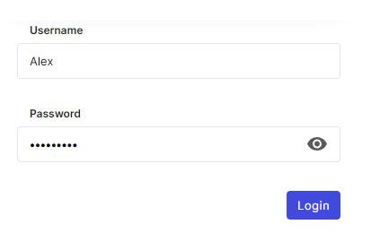](../../img/screenshots/rights-assignment/test-permissions.png)

| **Test** | **Result** |
| --- | --- |
| Attempting to create or delete a new object in any class displays the message that you do not have sufficient permissions for this action. | [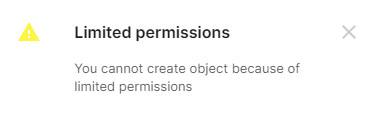](../../img/screenshots/rights-assignment/limited-permissions.png) |
| When calling an object, only the categories General, Accounting and Location should now display information. When trying to edit the category Location, it should be displayed that the user does not have sufficient permissions. | [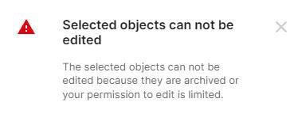](../../img/screenshots/rights-assignment/no-permissions.png)|

!!!info

    **Difference between Rights and Permissions:** docupike distinguishes between functional _rights_ and _permissions_ to access specific information in the documentation.

    **Rights:** A right allows a user to use a certain function or to define administrative settings.

    **Permission:** A permission grants a user access to a specific set of documented information. |

When accessing categories for which no permissions have been configured, only the "No permission" message is displayed instead of the information.

[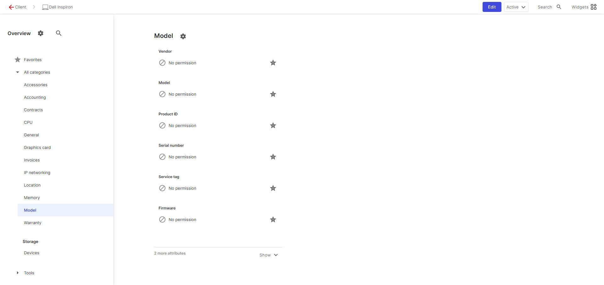](../../img/screenshots/rights-assignment/display-with-no-permission.png)

# Case-2: Share access to information with external parties

In some cases you may want to give external service providers or other companies access to information. To do this, you can simply create a separate group in docupike and configure special permissions for it.

We create a new group for "External" in User groups.

[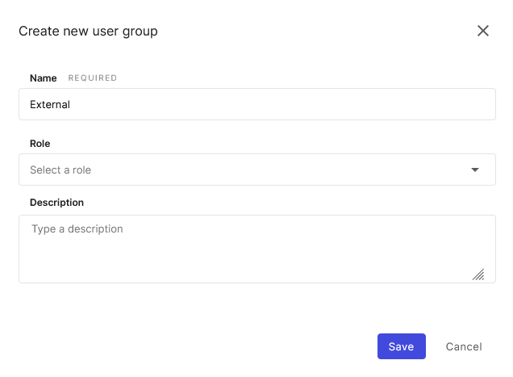](../../img/screenshots/rights-assignment/create-new-user-group.png)

Now we will configure the permission for this new user group. To do this, we change to the menu item Permission.

Here we **create a new permission** for the group External via the button "New Permission".

You can select a specific location and then configure whether all sub-locations should also be included (e.g. branch office + all associated rooms).

# Case 3: Access to specific classes

In some cases, you may want people or groups to have access only to certain classes. In this case, you can proceed as follows.

Create a new user group, in our case we will call it Application admin.

[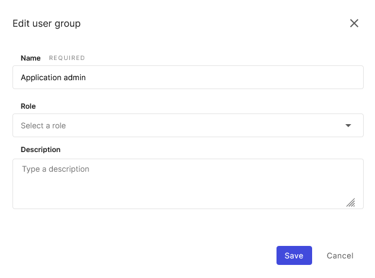](../../img/screenshots/rights-assignment/edit-user-group.png)

Now we will configure the permission for this new user group. To do this, we change to the menu item Permission.

Here we **create a new permission** for the group "Application admin" via the button "New Permission".

# Configure access to functions

As you have probably already noticed, the new user has no access to reports. This is due to the fact that we have not yet granted authorization for this. We switch back to the settings and go to the menu item **"Rights"** in the user management. Here we go to the item "Reports" and create a new right.

Again we select our group "Accounting" and activate all rights.

Now the function Reports of the User group Accounting is available and you can use existing reports or create your own.
